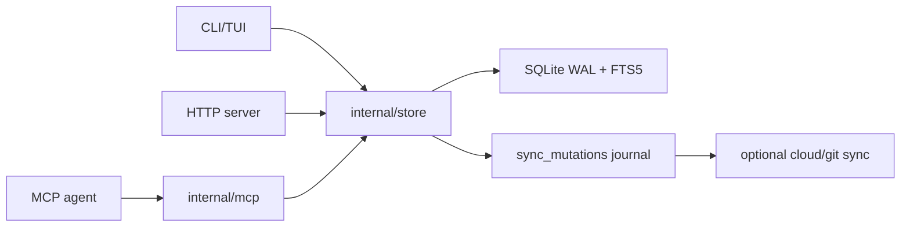

# Engram Memory System Report

## 1. Executive Summary

`engram` is a local-first memory system for coding agents. It is implemented as a single Go binary with SQLite + FTS5, exposed through CLI, HTTP, MCP stdio, TUI, and sync/cloud replication paths.

Compared to hosted memory services, Engram is intentionally practical: it stores structured coding-session observations, user prompts, sessions, relations, and sync mutations. It does not rely on embeddings by default. Retrieval is FTS5/BM25, recent context, pinned memories, topic-key exact lookup, and timeline drill-down.

The strongest ideas:

- Local SQLite as source of truth.
- MCP tool design tailored to real coding-agent workflows.
- Explicit session summaries and prompt capture.
- Topic-key upserts for evolving decisions.
- Conflict surfacing via candidate relations and `mem_judge`.
- Sync journal and cloud replication without making cloud authoritative.

Main risk: extraction is mostly agent discipline, not automatic semantic understanding. It works when the agent reliably calls `mem_save` with good structured content.

## 2. Mental Model

Engram memory units:

- `Session`: project/directory/time-bound work session.
- `Observation`: structured memory about a decision, bugfix, pattern, config, discovery, etc.
- `Prompt`: saved user prompt.
- `Relation`: agent/user judgment between observations.
- Sync mutation: durable local change journal.

Lifecycle:

```text
agent decides something -> mem_save -> AddObservation
-> topic_key upsert OR dedupe OR insert
-> FTS5 index trigger
-> sync mutation
-> conflict candidate detection
-> optional mem_judge relation
-> later mem_search / mem_context / mem_timeline
```

The memory is intentionally not a general transcript database. It is curated observations from coding sessions.

## 3. Architecture

Core files:

- `engram/internal/store/store.go`: persistent engine, schema, sessions, observations, prompts, search, sync journal.
- `engram/internal/store/relations.go`: relation vocabulary, conflict candidates, semantic judgment hooks.
- `engram/internal/mcp/mcp.go`: MCP tools and agent-facing behavior.
- `engram/internal/mcp/write_queue.go`: serialized MCP writes.
- `engram/internal/server/server.go`: HTTP API.
- `engram/internal/sync/sync.go`: local sync chunks.
- `engram/internal/cloud/*`: cloud replication/server/dashboard.
- `engram/internal/project/*`: project detection/similarity.

Architecture:



## 4. Essential Implementation Paths

Schema/migrations:

- `Store.migrate()` in `engram/internal/store/store.go`.
- Creates `sessions`, `observations`, `observations_fts`, `user_prompts`, `prompts_fts`, `sync_state`, `sync_mutations`, cloud/sync support tables, and triggers.

Session lifecycle:

- `CreateSession()` and `EndSession()` in `store.go`.
- Enqueue session sync mutations.
- MCP handlers: `handleSessionStart`, `handleSessionEnd`, `handleSessionSummary`.

Write path:

- MCP `mem_save` is defined and handled in `engram/internal/mcp/mcp.go`.
- `handleSave()` resolves project, normalizes project name, creates implicit session, calls `Store.AddObservation(...)`.
- `AddObservation()` strips `<private>...</private>`, truncates overlong content, normalizes scope/topic key, computes normalized hash.
- If `topic_key` exists, updates latest matching observation and increments `revision_count`.
- Otherwise exact duplicate within dedupe window increments `duplicate_count`.
- Otherwise inserts a new observation, sets `review_after` for selected types, and enqueues sync mutation.

Search path:

- MCP `handleSearch()` calls `Store.Search(...)`.
- `Search()` validates `match_mode`, normalizes project, performs direct `topic_key` lookup when query contains `/`, then FTS5 `MATCH`, sorted by rank.
- Filters: type, project, scope, match mode, limit.

Context path:

- `FormatContext()` in `store.go`.
- Combines recent sessions, pinned observations, recent unpinned observations, and recent prompts.
- MCP `mem_context` exposes this to agents.

Conflict/relation path:

- `FindCandidates()` in `engram/internal/store/relations.go`.
- `handleSave()` calls it after saving and returns `judgment_required` with candidates.
- `mem_judge` and `mem_compare` persist relation verdicts.
- Relation verbs include `related`, `compatible`, `scoped`, `conflicts_with`, `supersedes`, `not_conflict`.

Tests:

- Store tests: `engram/internal/store/*_test.go`.
- MCP tests: `engram/internal/mcp/*_test.go`.
- Sync/cloud tests across `internal/sync` and `internal/cloud`.

## 5. Memory Data Model

Key structs in `store.go`:

- `Session`: `id`, `project`, `directory`, timestamps, summary.
- `Observation`: `id`, `sync_id`, `session_id`, `type`, `title`, `content`, `tool_name`, `project`, `scope`, `topic_key`, `revision_count`, `duplicate_count`, `last_seen_at`, `review_after`, `pinned`, timestamps, `deleted_at`.
- `Prompt`: saved user prompt linked to session/project.
- `SyncMutation`: seq, target, entity, op, payload, source, project, ack.

SQLite schema:

- `observations` is the main table.
- `observations_fts` indexes title/content/tool/type/project/topic key.
- `user_prompts` and `prompts_fts` capture prompts.
- `memory_relations` is managed in relation migrations.
- `sync_mutations` is the local change journal.

Scoping:

- Project names are normalized.
- Observation scope defaults to `project`; `personal` is also supported.
- Pinned state is local and not synced.

## 6. Retrieval Mechanics

Retrieval modes:

- FTS5 lexical search over observations.
- Topic-key direct lookup.
- Recent context assembly.
- Pinned-priority context.
- Timeline around an observation.
- Full observation fetch after search.
- Prompt search.

Strengths:

- Deterministic, local, fast.
- No vector DB needed.
- FTS query sanitization and match-mode validation.
- Progressive disclosure: search -> get/timeline.

Weakness:

- No semantic recall by default.
- Quality depends on titles/content/topic keys being well-written.
- Cross-project recall exists, but project naming drift is a real operational concern; Engram explicitly warns on similar project names.

## 7. Write Mechanics

`AddObservation()` is carefully engineered:

- Normalizes project.
- Strips private tags.
- Truncates to configured max length.
- Normalizes scope and topic key.
- Computes normalized content hash.
- Topic-key match updates in place and increments revisions.
- Short-window duplicates increment duplicate count.
- New rows get sync IDs and optional lifecycle `review_after`.
- Every mutation is journaled for sync.

MCP `handleSave()` adds agent-facing behavior:

- Project resolution and recovery tokens for ambiguous project choices.
- Implicit session creation.
- Suggested topic keys.
- Similar project warning.
- Prompt auto-capture.
- Conflict candidates returned in response envelope.

## 8. Agent Integration

MCP is the main integration surface.

Core tools:

- `mem_save`
- `mem_search`
- `mem_context`
- `mem_session_summary`
- `mem_get_observation`
- `mem_save_prompt`
- `mem_current_project`

Deferred/admin tools include update/delete/stats/timeline/review/pin/unpin/judge/compare/capture/merge.

The server instructions explicitly tell agents to save decisions, bugfixes, discoveries, conventions, and end-of-session summaries. This is a strong affordance pattern: the tool names and descriptions shape agent behavior.

## 9. Reliability, Safety, and Trust

Strengths:

- Local SQLite with WAL and single connection.
- Sync mutations make local writes durable and replayable.
- Soft delete by default; hard delete available.
- Project normalization and ambiguity recovery.
- Private-tag stripping.
- Conflict candidates avoid silent overwrites.
- Lifecycle review for selected memory types.
- Extensive tests.

Risks:

- Agent must remember to save.
- No automatic extraction from all conversation turns by default.
- Lexical retrieval misses paraphrases.
- `mem_judge` relies on agent/user judgment; not a cryptographic verification system.
- Prompt capture can store sensitive user requests unless policy/agent behavior avoids it.

## 10. Tests, Evals, and Benchmarks

Engram has broad unit and integration tests:

- Store migration/search/sync tests.
- MCP tests for save/search/judge/compare/conflict loops.
- Cloud sync and mutation tests.
- Diagnostic/repair tests.
- TUI/project/setup tests.

I did not run them during this report generation.

## 11. Patterns Worth Stealing

- Local SQLite + FTS5 as a serious baseline.
- Agent-facing `mem_save` schema with What/Why/Where/Learned.
- Topic-key upsert for evolving decisions.
- Post-save conflict candidate surfacing.
- End-of-session summary as mandatory memory hygiene.
- Pinned memories before recent memories in context.
- Project detection plus similar-project warnings.
- Sync journal separate from cloud authority.

## 12. Antipatterns / Risks

- Memory quality depends on agent compliance.
- No embedding/semantic default may frustrate natural-language recall.
- Large MCP tool surface can overwhelm weaker agents despite deferred loading.
- Local-first sync semantics are more complex than a purely local tool if cloud is enabled.

## 13. Build-vs-Borrow Takeaways

Borrow heavily if building coding-agent memory:

- The observation schema.
- The MCP affordances.
- Topic-key upserts.
- Conflict surfacing.
- Local SQLite/FTS5 baseline.
- Session summary format.

Avoid copying if your target is consumer chat personalization or multi-tenant hosted memory; Engram is optimized for developer workflows.

## 14. Open Questions

- How well do agents comply with proactive save instructions in practice?
- What is the best semantic-search extension while keeping local-first simplicity?
- How often do conflict candidates produce useful judgments versus noise?
- How should sensitive prompt capture be governed?

## Appendix: File Index

- Store/schema/search: `engram/internal/store/store.go`.
- Relations/conflicts: `engram/internal/store/relations.go`.
- MCP tools: `engram/internal/mcp/mcp.go`.
- Write queue: `engram/internal/mcp/write_queue.go`.
- HTTP server: `engram/internal/server/server.go`.
- Sync: `engram/internal/sync/`, `engram/internal/cloud/`.
- Tests: `engram/internal/**/*_test.go`.

