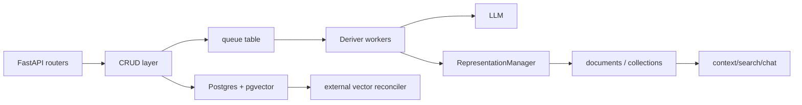

# Honcho Memory System Report

## 1. Executive Summary

`honcho` is a FastAPI/Postgres memory service for stateful agents. Its core model is not "store arbitrary facts"; it stores messages/events, then derives peer-centric representations in the background. The system models workspaces, sessions, peers, messages, message embeddings, observer/observed collections, documents/observations, queue items, and active queue sessions.

This is one of the more serious service architectures in the workspace. It has:

- Raw message event log.
- Async derivation queue.
- Derived explicit/deductive observations.
- Peer-to-peer representation model.
- pgvector or external vector-store paths.
- Session context/search APIs.
- Bench/eval harnesses for LoCoMo, LongMem, BEAM, Oolong, etc.

The strongest idea is the separation between raw messages and inferred representations. The main risk is eventual consistency and trust: derived observations are LLM-generated and embedded, but the code reviewed does not show a hard verification gate before they become queryable memory.

## 2. Mental Model

Honcho's memory model:

- `Message`: raw interaction/event in a session from a peer.
- `MessageEmbedding`: chunked embedding rows for message semantic search.
- `Collection`: a pairwise observer/observed memory space.
- `Document`: derived observation about an observed peer from an observer's perspective.
- `Representation`: in-memory object combining explicit and deductive observations.

Lifecycle:

```text
session.add_messages -> messages table + optional pending embeddings
-> enqueue representation tasks
-> deriver batches messages
-> LLM extracts PromptRepresentation
-> RepresentationManager embeds observations
-> documents table / vector store
-> query via representation/session/search/chat/context endpoints
```

The peer-centric idea matters: a collection is not merely "Alice's memory"; it can be "observer X's representation of observed Y".

## 3. Architecture

Core files:

- `honcho/src/models.py`: SQLAlchemy schema.
- `honcho/src/crud/message.py`: message creation/search/context helpers.
- `honcho/src/crud/document.py`: document CRUD and vector search.
- `honcho/src/crud/representation.py`: representation save/retrieve logic.
- `honcho/src/deriver/deriver.py`: LLM-derived observation processing.
- `honcho/src/deriver/enqueue.py`: queue record generation.
- `honcho/src/deriver/queue_manager.py`: worker polling, batching, stale cleanup.
- `honcho/src/dialectic/chat.py`, `honcho/src/dialectic/core.py`: query answering over peer memory.
- `honcho/src/reconciler/*`: vector reconciliation.

Architecture:



## 4. Essential Implementation Paths

Message capture:

- `create_messages()` in `honcho/src/crud/message.py`.
- Ensures session/peers exist.
- Uses `pg_advisory_xact_lock(hashtext(workspace), hashtext(session))` to serialize sequence assignment.
- Assigns `seq_in_session`.
- Creates pending `MessageEmbedding` rows if `settings.EMBED_MESSAGES`.

Queueing:

- `enqueue()` and `handle_session()` in `honcho/src/deriver/enqueue.py`.
- Resolves workspace/session/message configuration.
- Generates queue records for representation and summary tasks.
- Cancels pending dreams for active observed peers.

Derivation:

- `process_representation_tasks_batch()` in `honcho/src/deriver/deriver.py`.
- Sorts messages, formats timestamped turns, builds `minimal_deriver_prompt(...)`.
- Calls `honcho_llm_call(..., response_model=PromptRepresentation, json_mode=True)`.
- Converts response to `Representation`.
- Saves observations for all observer collections via `RepresentationManager.save_representation(...)`.

Representation storage:

- `RepresentationManager.save_representation()` in `honcho/src/crud/representation.py`.
- Normalizes observations.
- Batch embeds observation text.
- Writes documents through `crud.create_documents(...)`.
- Schedules dream processing when enabled.

Representation retrieval:

- `get_working_representation()` and `_get_working_representation_internal()` in `honcho/src/crud/representation.py`.
- Mixes semantic, most-derived, and recent observations within `max_observations`.

Message search:

- `search_messages()` and helpers in `honcho/src/crud/message.py`.
- Supports pgvector and external vector-store paths.
- Deduplicates chunk hits by message ID.
- Adds context windows around matched messages.
- Scopes peer searches to sessions where observer has membership.

Document search:

- `query_documents()` and helpers in `honcho/src/crud/document.py`.
- Uses pgvector cosine distance or external vector store, then fetches ordered DB rows.

Tests:

- `honcho/tests/crud/test_representation_manager.py`
- `honcho/tests/deriver/test_deriver_processing.py`
- `honcho/tests/integration/test_representation.py`
- `honcho/tests/integration/test_message_embeddings.py`
- `honcho/tests/unified/test_cases/*`
- `honcho/tests/bench/*`

## 5. Memory Data Model

Important tables from `honcho/src/models.py`:

- `workspaces`: tenant/config root.
- `peers`: people, agents, groups, projects, ideas.
- `sessions`: event containers.
- `session_peers`: peer membership/configuration per session.
- `messages`: raw message log, full-text indexed.
- `message_embeddings`: chunk embeddings, sync state, HNSW index.
- `collections`: unique `(observer, observed, workspace_name)`.
- `documents`: derived observations with `level`, `times_derived`, embedding, source IDs, soft delete, session link.
- `queue`: background tasks.
- `active_queue_sessions`: work-unit ownership.

The `Document.level` field distinguishes explicit and deductive observations. `times_derived` tracks reinforcement/derivation count. `source_ids` can support derivation trees.

Scoping is strong: most tables include `workspace_name`, and peer/session relationships are composite-key constrained.

## 6. Retrieval Mechanics

Honcho has several retrieval paths:

- Message semantic search over `message_embeddings`.
- Message full-text index exists on `messages.content`.
- Document semantic search over `documents.embedding`.
- Recent observations.
- Most-derived observations.
- Session-limited context.
- Peer-visible sessions when observer is provided.
- Dialectic agent chat over peer representation.

`RepresentationManager._get_working_representation_internal()` splits the observation budget:

- Semantic observations if query supplied.
- Most-derived observations when requested.
- Recent observations for the remainder.

This is a useful pattern: it avoids pure semantic recall and includes low-latency, stable representation context.

## 7. Write Mechanics

Honcho writes raw messages synchronously and derived memories asynchronously.

Message write:

- Transactional session/sequence handling.
- Optional chunk preparation.
- Embedding work deferred through pending rows/reconciler.

Derived write:

- Queue worker batches representation tasks.
- LLM call extracts explicit/deductive observations.
- Observations are batch embedded.
- `create_documents(..., deduplicate=settings.DERIVER.DEDUPLICATE)` handles persistence.

This is operationally sound for service latency: message ingestion does not wait on derivation. The tradeoff is stale reads immediately after writes.

## 8. Agent Integration

Surfaces:

- FastAPI routers under `honcho/src/routers/`.
- Python and TypeScript SDKs under `honcho/sdks/`.
- MCP server under `honcho/mcp/`.
- Agent integrations and examples.

Agent-facing operations include:

- Add messages to sessions.
- Ask a peer chat question.
- Get session context.
- Search peer/session/global memory.
- Fetch representations.
- Inspect queue status.

The system expects applications to store interaction history, then let Honcho reason in the background.

## 9. Reliability, Safety, and Trust

Strengths:

- Raw messages preserved separately from derived observations.
- Queue ownership and stale cleanup exist.
- Advisory locks prevent session sequence races.
- Soft deletes on documents.
- Vector sync state tracks migration/reconciliation.
- Tests cover migrations, queueing, deriver, routes, SDKs, and benchmarks.

Risks:

- LLM-derived observations become queryable documents without a visible hard verification gate.
- Background reasoning creates eventual consistency; API users must handle freshness.
- Multi-peer observation configuration is powerful but easy to misconfigure.
- Prompt injection in messages can influence derived observations.
- Trust is partly implicit in "explicit" vs "deductive" and `times_derived`, not a full epistemic state.

## 10. Tests, Evals, and Benchmarks

Honcho has the richest test/eval footprint among these repos:

- Migration tests under `tests/alembic`.
- CRUD and representation manager tests.
- Deriver queue/processing tests.
- Integration tests for enqueue, embeddings, representation.
- Unified JSON test cases for observation topology, LongMem-style scenarios, configuration inheritance.
- Benchmark harnesses under `tests/bench` for BEAM, LoCoMo, LongMem, Oolong, etc.

I did not run these tests. The code structure suggests a serious test culture.

## 11. Patterns Worth Stealing

- Raw event log plus derived representation documents.
- Observer/observed collections for multi-peer memory.
- Async derivation queue with explicit work-unit ownership.
- Blend semantic/recent/most-derived observations for working context.
- Advisory locks for session sequence assignment.
- Vector reconciliation path for external vector stores.
- Deduplicated message search snippets with context windows.

## 12. Antipatterns / Risks

- Derived observations are persuasive but not necessarily verified.
- Complex peer observation config can create surprising memory visibility.
- Eventual consistency must be surfaced clearly to users.
- A large service footprint may be too heavy for local coding-agent memory.

## 13. Build-vs-Borrow Takeaways

Borrow:

- Message log separated from derived memory.
- Peer/observer modeling if building multi-agent systems.
- Context blend: semantic + recent + reinforced.
- Queue/reconciler architecture.

Avoid if your goal is a small local memory layer. Honcho is closer to memory infrastructure for products and teams.

## 14. Open Questions

- How exactly does `create_documents(..., deduplicate=...)` decide duplicates?
- What is the production meaning of `times_derived`?
- How are bad derived observations corrected or contradicted?
- What freshness guarantees are documented to SDK users?
- How much does the dreamer layer alter long-term representations?

## Appendix: File Index

- Schema: `honcho/src/models.py`.
- Message write/search: `honcho/src/crud/message.py`.
- Documents: `honcho/src/crud/document.py`.
- Representation: `honcho/src/crud/representation.py`.
- Deriver: `honcho/src/deriver/deriver.py`, `honcho/src/deriver/enqueue.py`, `honcho/src/deriver/queue_manager.py`.
- Dialectic chat: `honcho/src/dialectic/`.
- Reconciler: `honcho/src/reconciler/`.
- Tests/evals: `honcho/tests/`.

