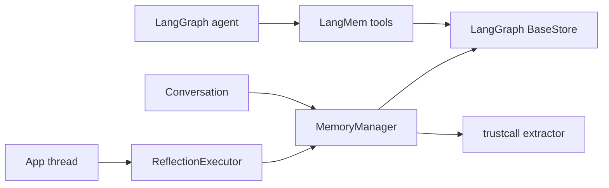

# LangMem Memory System Report

## 1. Executive Summary

`langmem` is not a full memory service. It is a compact set of LangGraph/LangChain primitives for agent memory tools, background reflection, structured extraction, and prompt optimization. The repository intentionally delegates persistence, indexing, and retrieval quality to LangGraph's `BaseStore`.

The essential implementation lives in:

- `langmem/src/langmem/knowledge/tools.py`
- `langmem/src/langmem/knowledge/extraction.py`
- `langmem/src/langmem/reflection.py`
- `langmem/src/langmem/short_term/summarization.py`

The main value is ergonomic integration: it gives agents memory tools they can call in the hot path and managers/executors that can extract/consolidate in the background. It is best understood as a memory control plane for LangGraph apps, not as a storage or retrieval engine.

## 2. Mental Model

LangMem treats memory as an item in a LangGraph `BaseStore`, namespaced by a tuple. The memory value is usually:

```python
{"content": <string or JSON-serializable structured object>}
```

The memory lifecycle has two main modes:

```text
hot path:
agent -> manage_memory tool -> BaseStore.put/delete
agent -> search_memory tool -> BaseStore.search

background:
conversation -> MemoryManager/trustcall extractor -> extracted memories
-> create_memory_store_manager persists results to BaseStore
-> ReflectionExecutor schedules async/local/remote reflection
```

Memory is agent-controlled in the tool path and LLM-managed in the background manager path.

## 3. Architecture

Runtime shape:



Key dependency choices:

- `BaseStore` provides persistence and search.
- `trustcall.create_extractor` provides insert/update/delete structured extraction.
- LangGraph runtime provides store/config context.
- Remote reflection can use LangGraph Platform client APIs.

## 4. Essential Implementation Paths

Hot-path write:

- `create_manage_memory_tool()` in `langmem/src/langmem/knowledge/tools.py`.
- Builds sync and async `manage_memory` functions.
- Validates action: `create`, `update`, `delete`.
- Resolves namespace via `utils.NamespaceTemplate`.
- Uses `store.put/aput` for create/update and `store.delete/adelete` for delete.

Hot-path search:

- `create_search_memory_tool()` in `langmem/src/langmem/knowledge/tools.py`.
- Calls `store.search/asearch(namespace, query, filter, limit, offset)`.
- Returns JSON serialized items, optionally with raw artifact.

Background extraction:

- `MemoryManager` in `langmem/src/langmem/knowledge/extraction.py`.
- `_MEMORY_INSTRUCTIONS` defines semantic/procedural/episodic extraction goals.
- Uses `trustcall.create_extractor(...)` with schemas and update/delete options.
- Supports multiple refinement steps through `max_steps`.
- Returns `ExtractedMemory(id, content)` tuples.

Background persistence:

- `create_memory_store_manager()` in `langmem/src/langmem/knowledge/extraction.py`.
- Wires `MemoryManager` to a store namespace and persists extracted results.

Reflection queue:

- `ReflectionExecutor()` in `langmem/src/langmem/reflection.py`.
- `LocalReflectionExecutor` runs a background thread and cancels pending work for the same thread ID.
- `RemoteReflectionExecutor` submits runs to LangGraph Platform.

Tests:

- `langmem/tests/test_docstring_examples.py`
- `langmem/tests/short_term/test_summarization.py`
- `langmem/tests/short_term/test_summarization_async.py`

## 5. Memory Data Model

LangMem itself defines little persistent schema. The store item is provided by LangGraph:

- namespace: tuple path, often with runtime placeholders like `{langgraph_user_id}`.
- key: UUID string.
- value: `{"content": ...}`.
- created/updated timestamps and search score are provided by store implementation.

Custom memory shape comes from the `schema` argument:

- Default hot-path tool schema is `str`.
- Background extraction default is `Memory(content: str)`.
- Users can pass Pydantic models for structured memory.

Scoping is namespace-driven. This is flexible but pushes correctness to application convention.

## 6. Retrieval Mechanics

Retrieval is delegated to `BaseStore.search`.

LangMem does not implement:

- vector search itself.
- BM25.
- reranking.
- temporal filtering.
- entity linking.
- token budgeting.
- conflict-aware recall.

This is a feature and a limitation. The library composes with whatever LangGraph store is configured. In production, retrieval quality depends almost entirely on the store configuration and how the app injects results into prompts.

## 7. Write Mechanics

Hot-path writes are direct tool writes:

- Create: generate UUID and `put`.
- Update: require ID and overwrite content at key.
- Delete: require ID and delete key.

Background writes are extractor-driven:

- `MemoryManager` prepares a conversation packet and existing memories.
- The extractor may insert, update, or delete depending on flags.
- Existing memory IDs are preserved when updating.
- Deletes are disabled by default (`enable_deletes=False`).

Important design choice: LangMem makes memory editing explicit and schema-aware but does not enforce provenance, trust, or conflict policy.

## 8. Agent Integration

This is where LangMem is strongest.

Surfaces:

- `create_manage_memory_tool(...)`: agent-callable memory mutation.
- `create_search_memory_tool(...)`: agent-callable recall.
- `create_memory_manager(...)`: background extraction manager.
- `create_memory_store_manager(...)`: store-persisting background manager.
- `ReflectionExecutor(...)`: local or remote background submission.

The namespace template is the integration hinge. It lets the same tool definition scope memories by user, team, project, or arbitrary runtime config.

Risk: the agent must decide when to use tools unless the app performs hot-path prompt injection or background reflection.

## 9. Reliability, Safety, and Trust

Strengths:

- Very small behavioral surface.
- Store abstraction avoids lock-in.
- Create/update/delete validation is simple and clear.
- Background executor cancels older pending reflection for a thread.
- Structured extraction can use Pydantic schemas.

Risks:

- No built-in provenance model.
- No memory confidence or verification state.
- No first-class contradiction handling beyond update/delete.
- Namespace mistakes can leak or fragment memory.
- Background worker thread is in-process and not durable unless using remote LangGraph execution.
- Prompt injection safety depends on user schemas/prompts and downstream store/prompt rendering.

## 10. Tests, Evals, and Benchmarks

The repo has modest tests focused on docstring examples and short-term summarization. It does not appear to contain a deep memory retrieval/evaluation suite.

Missing tests I would want:

- Namespace isolation.
- Tool behavior under malformed IDs/actions.
- Background extraction with contradictory memories.
- Store persistence behavior across different BaseStore implementations.
- Prompt injection in extracted memory content.

## 11. Patterns Worth Stealing

- Keep memory tools as thin wrappers over a generic store.
- Use namespace templates to avoid hard-coding user/project scope.
- Support both hot-path agent tools and background reflection.
- Let users provide structured memory schemas.
- Use background task cancellation keyed by thread ID to avoid stale reflection runs.

## 12. Antipatterns / Risks

- Delegating retrieval entirely to the store means memory quality is invisible at the LangMem layer.
- Direct update/delete tool semantics can let an agent overwrite memory without provenance.
- Background memory manager instructions are ambitious relative to the enforcement in code.
- No trust distinction between extracted, inferred, corrected, or verified memory.

## 13. Build-vs-Borrow Takeaways

Borrow:

- The `BaseStore`-style interface idea.
- Namespace template design.
- Separate hot-path tools from background reflection.
- Schema-parametric memory extraction.

Do not borrow as-is if you need:

- Strong correctness guarantees.
- Multi-signal retrieval.
- Durable queues.
- Tenant/security boundaries.
- Audit-grade provenance.

LangMem is best when you are already building on LangGraph and want memory primitives, not a full memory platform.

## 14. Open Questions

- How retrieval quality varies across LangGraph store implementations.
- Whether LangGraph Platform deployments add production-grade memory processing beyond this package.
- How users are expected to handle contradiction and deletion policies.
- Whether background reflection should become durable outside LangGraph Platform.

## Appendix: File Index

- Memory tools: `langmem/src/langmem/knowledge/tools.py`.
- Extraction manager: `langmem/src/langmem/knowledge/extraction.py`.
- Reflection executor: `langmem/src/langmem/reflection.py`.
- Graph/RAG extras: `langmem/src/langmem/graph_rag.py`, `langmem/src/langmem/graphs/`.
- Short-term summarization: `langmem/src/langmem/short_term/summarization.py`.
- Tests: `langmem/tests/`.

