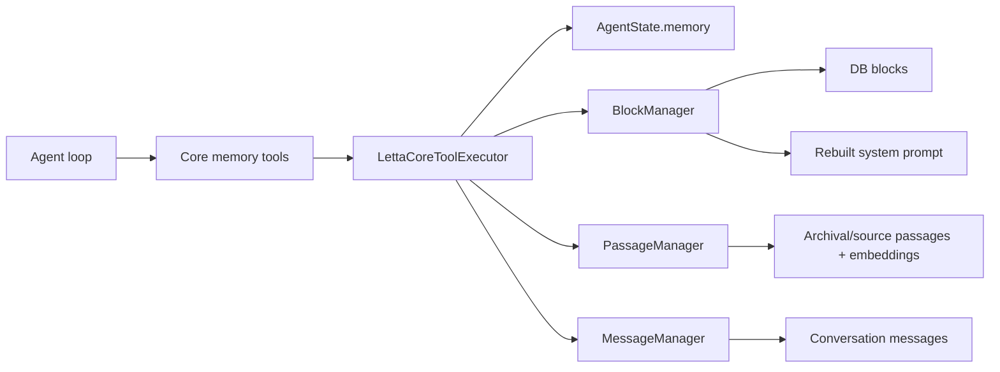

# Letta Memory System Report

## 1. Executive Summary

`letta` is an agent runtime with memory as part of agent state. Its memory model is older and deeper than most repos here: core in-context memory blocks, archival semantic memory, recall over conversation history, file/source memory, and newer git-backed memory projection support.

The essential distinction:

- Core memory is prompt-resident block state that the agent edits with tools.
- Archival memory is searchable passage storage.
- Recall memory is prior conversation history search.
- Source/file memory is document passages attached through sources/files.

Letta's strongest idea is making memory editing explicit inside the tool loop, with block-level prompt recompilation after changes. Its biggest risk is that the agent is trusted to edit its own core memory; correctness depends on tool rules, exact-string edits, read-only flags, and runtime enforcement.

## 2. Mental Model

Letta memory layers:

- `Memory`: in-context memory object containing `Block` objects.
- `Block`: labeled prompt memory section such as `human`, `persona`, `system/persona`, or custom paths.
- `ArchivalPassage`: long-term semantic memory attached to an archive/agent.
- `SourcePassage`: chunks from uploaded files/sources.
- Conversation messages: searchable prior interaction history.

Lifecycle:

```text
agent receives prompt -> system prompt includes compiled core memory
-> agent calls memory tools
-> core tool executor mutates AgentState.memory or inserts/searches passages
-> AgentManager persists changed memory and rebuilds system prompt
-> future LLM calls see updated core memory
```

Letta is memory-as-agent-state, not just memory-as-RAG.

## 3. Architecture

Core files:

- `letta/letta/schemas/memory.py`: `Memory`, `BasicBlockMemory`, rendering/compilation.
- `letta/letta/functions/function_sets/base.py`: tool schemas/docs for memory functions.
- `letta/letta/services/tool_executor/core_tool_executor.py`: actual execution of core memory tools.
- `letta/letta/services/block_manager.py`: block CRUD, tags, prompt rebuild triggers.
- `letta/letta/services/passage_manager.py`: archival/source passage persistence.
- `letta/letta/services/message_manager.py`: conversation search extraction/indexing.
- `letta/letta/orm/block.py`: block schema and optimistic locking.
- `letta/letta/orm/passage.py`: archival/source passage schema.
- `letta/letta/services/memory_repo/*`: git-backed memory projection.

Runtime shape:



## 4. Essential Implementation Paths

Core prompt rendering:

- `Memory.compile()` in `letta/letta/schemas/memory.py`.
- Renders XML-ish `<memory_blocks>` for normal agents.
- For git-enabled agents, `_render_memory_blocks_git()` renders `system/persona` as `<self>` and other `system/*` blocks under `<memory>`.
- For selected Anthropic agent types, `_render_memory_blocks_line_numbered()` adds line numbers as view-only context.

Core memory mutation:

- Tool definitions are documented in `letta/letta/functions/function_sets/base.py`.
- Actual runtime implementation is `LettaCoreToolExecutor.execute()` in `letta/letta/services/tool_executor/core_tool_executor.py`.
- `core_memory_append()`, `core_memory_replace()`, `memory_replace()`, `memory_insert()`, and `memory_apply_patch()` mutate `agent_state.memory`.
- After mutation, executor calls `agent_manager.update_memory_if_changed_async(...)`.

Archival write/search:

- `archival_memory_insert()` in `core_tool_executor.py` calls `passage_manager.insert_passage(...)` then rebuilds the system prompt.
- `archival_memory_search()` delegates to `agent_manager.search_agent_archival_memory_async(...)`.
- `PassageManager.create_agent_passage_async()` and `create_agent_passages_async()` persist `ArchivalPassage` rows with embeddings and tags.

Conversation recall:

- `conversation_search()` in `core_tool_executor.py`.
- Calls `message_manager.search_messages_async(...)`.
- Filters out tool messages and assistant calls to `conversation_search` to avoid recursive results.
- Formats structured results with timestamp, time delta, role, content, and RRF/vector/FTS metadata when available.

Block persistence:

- `BlockManager.update_block_async()` persists block changes, handles tag rows, and rebuilds system prompts for connected agents when prompt-affecting fields change.
- `letta/letta/orm/block.py` defines `version_id_col` optimistic locking.

Tests:

- `letta/tests/test_memory.py`
- `letta/tests/managers/test_block_manager.py`
- `letta/tests/managers/test_passage_manager.py`
- `letta/tests/managers/test_message_manager.py`
- `letta/tests/test_block_manager_noop_update.py`
- `letta/tests/performance_tests/test_insert_archival_memory.py`

## 5. Memory Data Model

Core memory:

- `Memory.blocks`: list of `Block` schemas.
- `Block`: label, value, description, limit, read-only flag, metadata, tags.
- `Block` ORM includes optimistic `version`, current history pointer, template/project/org fields.

Archival/source memory:

- `BasePassage`: `id`, `text`, embedding config, metadata, tags, embedding.
- `ArchivalPassage`: attached to archive.
- `SourcePassage`: attached to source/file and file name.
- Passage tags are stored both in JSON and a junction table for filtering.

Conversation recall:

- Message records are indexed/searchable by `MessageManager`.
- `_extract_message_text()` normalizes complex message content into JSON text and skips heartbeat/send-message/search tool noise.

Scoping:

- Organization/user/agent boundaries are embedded throughout managers and ORM mixins.
- Agents connect to blocks through `blocks_agents`.
- Archives connect to agents through archive manager/pivot tables.

## 6. Retrieval Mechanics

Retrieval layers:

- Core memory is always prompt-resident.
- Archival search uses semantic passage retrieval through the agent manager/passage infrastructure.
- Conversation search uses hybrid search metadata: `combined_score`, `vector_rank`, `fts_rank`, `search_mode`.
- Source/file passages support document memory.

Letta's main retrieval idea is not "always search everything"; it gives the agent tools:

- Use `archival_memory_search` when it needs long-term facts.
- Use `conversation_search` when it needs prior conversation details.
- Rely on core memory for always-on stable state.

Risk: the agent must know which layer to query. Core memory can become stale or bloated if the agent edits poorly.

## 7. Write Mechanics

Core memory writes are precise edits:

- Append.
- Exact string replace.
- Insert at line.
- Apply unified-diff-like patch.
- Create/delete/rename memory blocks through the broader `memory` tool path.

Guardrails:

- Read-only block check.
- Line-number-prefix rejection.
- Exact replace must match once.
- Patch hunk must match unique context.
- Prompt is rebuilt after memory changes.

Archival writes:

- `PassageManager` pads embeddings for Postgres vector dimensions.
- Removes null bytes before DB insert.
- Deduplicates tags.
- Batch creation available.

## 8. Agent Integration

Memory is deeply integrated with Letta's agent loop.

Core tools:

- `core_memory_append`
- `core_memory_replace`
- `memory_replace`
- `memory_insert`
- `memory_apply_patch`
- `memory`
- `archival_memory_insert`
- `archival_memory_search`
- `conversation_search`

Constants in `letta/letta/constants.py` define base memory tool sets for different agent families, including v1/v2/v3 and sleeptime variants.

This is powerful because memory edits happen as part of the agent's reasoning/action loop. It is risky because the same model that may be confused is allowed to edit its own durable state.

## 9. Reliability, Safety, and Trust

Strengths:

- Core memory block limits and read-only flags.
- Optimistic locking on block ORM.
- Tool executor catches errors and returns tool errors rather than crashing the loop.
- Prompt rebuild happens after persisted block changes.
- Conversation search suppresses recursive/tool-result pollution.
- Exact edit tools reduce accidental broad rewrites.

Risks:

- Agent-controlled memory can silently encode wrong beliefs.
- No first-class verified/candidate/rejected trust layer.
- Core memory is prompt-resident and token-sensitive.
- Exact-string editing is brittle.
- Archival memory insertion trusts agent-provided content.
- Git-backed memory projection adds another synchronization surface.

## 10. Tests, Evals, and Benchmarks

Relevant tests exist for memory, block, passage, message, summarizer, and archival-memory performance. I did not run them.

Missing tests I would want:

- Agent memory edit mistakes under line-numbered prompts.
- Prompt injection through archival search results.
- Read-only block enforcement across every memory tool path.
- Conflict handling when user facts change.
- Core memory token pressure and summarization interactions.

## 11. Patterns Worth Stealing

- Separate always-on core memory from searchable archival memory.
- Use labeled blocks with descriptions, limits, and read-only flags.
- Rebuild prompts automatically after memory mutation.
- Exact edit tools with uniqueness checks.
- Conversation search filters that avoid recursive tool-output pollution.
- Git-backed memory projection for developers comfortable with file semantics.

## 12. Antipatterns / Risks

- Letting the agent directly rewrite its own identity/user model without verification.
- Core memory as unstructured text blocks can become a junk drawer.
- Multiple memory tool generations create conceptual complexity.
- Exact string replacement is safe but brittle for long evolving blocks.

## 13. Build-vs-Borrow Takeaways

Borrow:

- Core vs archival vs recall separation.
- Block metadata and read-only controls.
- Prompt rebuild after state changes.
- Patch-style memory editing.

Avoid copying:

- Unlimited model authority over durable beliefs.
- Unstructured core memory without provenance.
- Too many overlapping memory tool APIs unless backward compatibility requires it.

Letta is worth studying if you are building a full agent runtime. It is heavier than needed for a standalone memory service.

## 14. Open Questions

- How does Letta decide when to compact/summarize versus preserve raw conversation history?
- How are wrong core memories corrected in practice?
- How mature is git-backed memory relative to block-backed memory?
- What retrieval fusion does `search_messages_async` use internally across DB backends?

## Appendix: File Index

- Core memory schema/rendering: `letta/letta/schemas/memory.py`.
- Tool docs/stubs: `letta/letta/functions/function_sets/base.py`.
- Tool runtime: `letta/letta/services/tool_executor/core_tool_executor.py`.
- Blocks: `letta/letta/services/block_manager.py`, `letta/letta/orm/block.py`.
- Passages: `letta/letta/services/passage_manager.py`, `letta/letta/orm/passage.py`.
- Conversation search: `letta/letta/services/message_manager.py`.
- Git memory: `letta/letta/services/memory_repo/`.
- Tests: `letta/tests/`.

