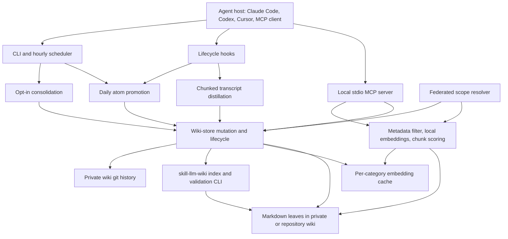

# llm-wiki-memory Memory System Report

## 1. Executive Summary

`llm-wiki-memory` is a local-first memory runtime for coding agents. It stores Markdown leaves in a filesystem wiki, maintains navigable `index.md` files through `@ctxr/skill-llm-wiki`, searches with on-device embeddings, and exposes the result through MCP, CLI commands, and Claude Code lifecycle hooks. Its primary memory unit is either a typed atomic note, a captured plan/investigation, or a verbatim full document. Private memory can be layered with repository-owned shared wikis.

The core philosophy is unusually explicit: memory owns content, placement, retrieval, and lifecycle; `@ctxr/skill-llm-wiki` owns tree structure and indexes. The strongest implementation work is around operational durability: recoverable transcript capture, deterministic placement, explicit write targets, per-operation wiki commits, scope federation, bounded context responses, opt-in consolidation, and a very broad test suite.

The weakest part is epistemic rather than operational. Extracted atoms are stored as active memories without candidate/verified/rejected states, source authority, contradiction records, or rejected-value tombstones. Git provides history, but not a truth model. Retrieval is semantic plus structured filtering, not genuinely hybrid lexical/vector search, and there is no checked-in retrieval-quality benchmark. The implementation is a strong reference for local coding-agent memory plumbing, but not for high-stakes belief governance.

Analysis target: checkout `b7cc76a493573baac133969b324a874990556146` (2026-07-18), package version `0.5.0`.

## 2. Mental Model

The system treats a memory as a Markdown leaf with schema-compatible top-level frontmatter and a nested `memory` metadata block. Three shapes coexist:

- **Atomic memory:** a typed `decision`, `bug-root-cause`, `feedback-rule`, `project-lore`, `reference`, `pattern-gotcha`, or `self-improvement-lesson` distilled from a session or written explicitly.
- **Workflow artifact:** a plan, investigation, issue-linked note, or dated daily capture.
- **Full document:** verbatim Markdown absorbed into a category with `memory.full: true`, searched across its full chunk set.

The lifecycle is:

1. Explicit MCP/CLI writes, plan hooks, or transcript hooks capture content.
2. Transcript capture distills structured atoms into a dated `daily/yyyy/mm/dd/` leaf. Failed distillation preserves raw fenced content and a retry stash.
3. `compile.mjs` promotes daily atoms into `knowledge/` or `self_improvement/`, searches for candidates, and chooses create/update/skip.
4. Retrieval prefilters active leaves by metadata, embeds the query, scores cached leaf/chunk embeddings, and merges results across the private and repository scope chain.
5. Session-start context and explicit MCP calls expose selected memories to the agent.
6. Mutations can update, move, archive, re-enable, or hard-delete a leaf. Optional consolidation deduplicates, refreshes, archives, compresses, and reindexes.

Control is hybrid. Agents explicitly call memory tools; Claude Code hooks automatically capture sessions and approved plans; background compile/consolidate jobs manage the corpus. Interactive `self_improvement` writes are server-gated on explicit consent. Policy requires asking before shared-repository writes, while the server deterministically enforces only the explicit repository target. The store generally treats active memory as usable guidance, not as candidate evidence. A `priority` field models apply strength, but not truth.

## 3. Architecture

Runtime components:

- `mcp-server/index.mjs` starts a local stdio MCP server and publishes shared memory discipline through MCP `instructions`.
- `scripts/lib/wiki-*.mjs` form the storage, placement, search, federation, lifecycle, embedding-cache, and git-commit layer.
- `scripts/hooks/` contains capture, session-start, compaction, plan, write-gate, and embedding-sync hooks.
- `scripts/compile*.mjs` promote captured daily atoms.
- `scripts/consolidate*.mjs` run deterministic and optional LLM refinement passes.
- `scripts/cron*.mjs` schedule compile plus consolidation and track per-entity failure episodes.
- `@ctxr/skill-llm-wiki` is invoked as a CLI subprocess through `scripts/lib/wiki-cli.mjs`; it owns generated indexes, validation, healing, and structural rebuilds.

Persistence is filesystem-first. Leaves and generated indexes live under `<mount>/.llm-wiki-memory/wiki/`; settings, logs, locks, stashes, health state, and audit files live under the data directory. Embeddings are cached per wiki/category. The private wiki may be its own git repository and auto-committed. Repository-owned shared mounts are intentionally never auto-staged or auto-committed.

Deployment assumes Node.js 20+, a local filesystem, the npm dependency, an optional local transformer model, and optional access to an LLM provider or authenticated CLI for extraction/merge work. There is no service database, Docker requirement, hosted control plane, or multi-tenant authentication layer.

## 4. Essential Implementation Paths

### Explicit Capture and Write

- `mcp-server/tools-write.mjs` registers `save_lesson`, `save_to_dataset`, and `write_memory`; `mcp-server/tools-absorb.mjs` registers `absorb_document`.
- `mcp-server/mcp-scopes.mjs` creates the active federated wiki context from required `scopes`.
- `scripts/lib/context/write.mjs` parses a strict nested write request; `scripts/lib/context/target.mjs` requires an explicit target.
- `mcp-server/mcp-write-dispatch.mjs::dispatchWrite()` validates topology paths, applies P0 scarcity, remaps invalid path facets, stamps repository identity, enters the selected write target, and batches one logical commit.
- `scripts/lib/wiki-mutate.mjs::writeMemory()` creates a new leaf and can archive/delete a superseded ID. `saveDocument()` performs recursive upsert-by-name and relocation when facets change.
- `scripts/lib/wiki-render.mjs::renderLeaf()` creates schema-compatible frontmatter, content hash, covers, brief, tags, update date, and nested metadata.
- State changes at the leaf file, generated ancestor indexes, embedding cache invalidation, and optional git commit.

### Automatic Session Capture

- Claude Code `pre-compact`, `post-compact`, and `session-end` wrappers call `scripts/hooks/flush.mjs`.
- `flush-source.mjs::buildSourceMaterial()` reads, redacts, and caps the transcript.
- `flush-worker.mjs::runWorker()` obtains a per-session lock and runs asynchronously from the hook deadline.
- `flush-distill.mjs::distillByChunks()` maps chunks through `flush-chunk-distill.mjs`, then reduces atoms through `flush-reduce.mjs`.
- `flush-validate.mjs::validateAtoms()` enforces the atom schema. `flush-render.mjs` emits a daily document, partial-failure blocks, or a fenced raw fallback.
- `flush-stash.mjs` preserves failed source material; `cli-redistill.mjs` and `flush-redistill*.mjs` retry it.
- `flush-write.mjs::writeFlushDoc()` writes to the configured daily slot and falls back to `daily` when misconfigured.

### Daily Promotion and Deduplication

- `scripts/compile.mjs::main()` locks against concurrent compile/consolidate, enumerates active `daily-*` leaves, and calls `compile-promote.mjs::processDaily()`.
- `compile-atoms.mjs::parseAtomsFromMarkdown()` and `scoreAtomQuality()` parse captured atoms and apply the optional strict quality floor.
- `compile-routing.mjs` selects the target dataset and filter fields.
- `compile-dedup.mjs::dedupCandidates()` retrieves same-type, same-facet candidates. `forcedLessonUpdate()` deterministically replaces the top same-`error_pattern` lesson.
- `compile-actions.mjs::decideAction()` asks an LLM for create/update/skip when no forced rule applies. `executeAction()` validates that an update's `supersedes` ID came from the candidate set, writes the replacement, and archives the old leaf.
- A fully processed daily leaf is archived. Failed promotion is retried up to `compile.metadataRetryLimit`, after which the source daily is archived to prevent duplicate-create loops.

### Retrieval and Search

- `mcp-server/tools-search.mjs` registers `search_memory` and `recall_lessons`, then clamps bodies and total output through `scripts/lib/search-clamp.mjs`.
- `scripts/lib/recall-search.mjs::searchMemory()` searches selected or all scoped categories and auto-injects the workspace `project_module` when filters are supplied.
- `scripts/lib/wiki-search.mjs::searchOneTree()` walks leaves, skips archived/unreadable documents, applies exact metadata membership/equality filters, embeds one query, batch-embeds cache misses, scores chunks, enforces a cosine floor, and reranks near ties by P0/P1/P2.
- `scripts/lib/wiki-search-fanout.mjs::searchMemoryFiltered()` runs that scorer per active wiki level. Comparable local results get a depth boost; clearly less relevant local results do not.
- `scripts/lib/recall.mjs::recallLessons()` broadens through a deterministic ladder: drop `error_pattern`, `language`, `task_type`, `area`, then `project_module`. It can append one `bug-root-cause` and one `feedback-rule` knowledge hit.

### Context Assembly and Injection

- `templates/agents-memory-instructions.md` is the canonical discipline loaded by `scripts/lib/discipline.mjs` into MCP initialization and the Claude Code session-start context.
- `scripts/hooks/session-start.mjs` triggers daily compile when due, emits default scope guidance, searches current work context, surfaces recent daily activity, and reports unresolved cron/monitoring health.
- `scripts/lib/work-context.mjs` builds active branch/issue and plan context.
- Search responses support frontmatter-only glance records, excerpted bodies, full bodies, a total character budget, and priority-aware truncation.
- Context assembly is mostly tool and hook mediated. There is no universal backend-owned prompt compiler comparable to Letta core memory.

### Update, Delete, Forget, and Conflict

- `scripts/lib/wiki-relocate.mjs` updates metadata and moves leaves while refusing destination collisions.
- `scripts/lib/wiki-lifecycle.mjs::disableDocument()` archives by setting `memory.status`; `enableDocument()` reverses it; `deleteDocument()` removes the file and cache entry; `truncateArchivedBody()` compacts old archived bodies while preserving the original source hash.
- `writeMemory({ supersedes })` writes a replacement and archives or deletes the selected prior document.
- `saveDocument()` refuses to clobber a different same-name leaf at the destination.
- There is no contradiction table, correction chain beyond `supersedes_id`, rejected-value tombstone, or multi-source corroboration model.

### Background Work and Operations

- `scripts/consolidate.mjs::consolidateMemory()` is opt-in and brain-only. It requires every category to declare `consolidate: refine|none`, shares the compile lock, and runs under an internal maintenance capability.
- `consolidate-run.mjs::runConsolidate()` runs per-leaf clustering, exact-hash/lesson-key/cosine dedup, optional LLM merge, staleness flagging, optional LLM refresh, orphan archive, archived-body compression, embedding pruning, and index rebuilding.
- `scripts/cron-job.mjs::runCronJob()` runs compile and consolidation, retains slim and full logs, updates per-entity healing state, and emits versioned issue reports after repeated failures.
- `scripts/lib/wiki-commit.mjs::withWikiCommit()` groups writes into one audit commit. `wiki-commit-git.mjs::gitUsable()` proves that the wiki is its own repository and excludes repository-owned shared categories.

### Tests and Evals

- The checkout contains 195 `*.test.mjs` files and roughly 1,700 declared `node:test` cases across unit and end-to-end directories.
- Capture/recovery: `capture-edge-cases.test.mjs`, `flush-*.test.mjs`, `cli-redistill.test.mjs`, `integration-redistill-2026-06-02.test.mjs`.
- Retrieval: `recall.test.mjs`, `read-fanout.test.mjs`, `embed-chunk.test.mjs`, `priority.test.mjs`, `search-snippet.test.mjs`.
- Write/safety: `wiki-store*.test.mjs`, `hardening-*.test.mjs`, `save-gate-audit.test.mjs`, `fence.test.mjs`.
- Federation/git: extensive `test/e2e/federation-*.e2e.test.mjs`, plus `wiki-context`, `scope-scanner`, `wiki-commit`, and ownership tests.
- Consolidation/cron: `consolidate-*.test.mjs`, `cron-job.test.mjs`, and `cron-healing.test.mjs`.
- There is no visible labeled query corpus or nDCG/MRR/recall-at-k benchmark for retrieval quality. `PERFORMANCE.md` measures latency and scaling, not relevance quality.

## 5. Memory Data Model

`scripts/lib/types-metadata.mjs` defines the persisted shape. Each leaf has:

- Top-level wiki fields: `id`, `type`, `depth_role`, `focus`, `parents`, `covers`, `source`, `updated`, optional `brief`, and optional tags.
- `source.origin` and `source.hash`, where the hash is over the leaf body.
- A nested `memory` block with required `atom_type`, `status`, and `priority`.
- Optional workspace/facet fields: `project_module`, `area`, `language`, `task_type`, `error_pattern`, tags, hierarchical `subject`, `full`, `stale`, `supersedes_id`, `consolidated_at`, `last_refreshed_at`, and `consolidate_truncated_at`.
- Plans may also have top-level `status` and `progress` derived from checkboxes.

Scoping is federated rather than tenant-based. `scope-scanner.mjs` walks each requested directory toward the user's home and discovers nested `.llm-wiki-memory` mounts. The private brain is depth 0. Repository levels use `project_id`, canonical git origin, or `file://<mount>` identity. Reads fan out; writes require an exact selected target.

Provenance is uneven. Manual and promoted documents preserve body hashes, timestamps, git commits, evidence excerpts, capture audits, and source session fields. However, atomic leaves do not carry a normalized list of source event IDs, actor authority, verified/candidate status, or multiple evidence records. A compiled atom can therefore be traceable to a daily capture but still has no explicit epistemic state.

Versioning is file plus git history. Updates often create a new leaf and archive the superseded one; same-name saves can overwrite in place. There is no TTL field. Staleness is derived from the top-level update date. Archive is reversible until archived bodies are truncated, at which point full recovery relies on git history.

## 6. Retrieval Mechanics

The retrieval engine is local vector-style search over a filesystem walk:

1. Select categories and walk all active leaves.
2. Apply structured frontmatter filters before embedding.
3. Embed the query with `Xenova/bge-large-en-v1.5` by default, falling back to a lexical hash vector when configured or when the transformer fails.
4. Load per-category content-hash caches and batch-compute missing vectors.
5. For recall, split long atomic notes into bounded chunks; full documents can use up to 256 chunks with no length penalty.
6. Rank by best chunk cosine minus a length penalty for ordinary long notes.
7. Apply score threshold, then stable priority reranking only within a configured score band.
8. Across scopes, add locality boost only to hits close enough to the global top cosine.

The design is strong on filters, scope, long-document handling, cache invalidation, and response budgets. It is weak on exact lookup from arbitrary free text: the lexical fallback is an alternative embedding backend, not a separately fused BM25/FTS channel. Identifiers and rare tokens depend on embedding behavior unless a topology provides deterministic lookup or metadata filters isolate them.

There is no query rewriting, cross-encoder reranker, recency term in the general score, graph traversal, or learned rank fusion. `recallLessons()` adds a useful deterministic scope-broadening ladder, but the thresholds and locality/priority bands are configuration heuristics without committed relevance benchmarks.

Likely failure modes include cold-cache latency, linear corpus scanning, semantic misses on exact identifiers, over-broad ladder results after facet drops, local-scope boost overpowering a marginally better private result inside the band, stale active leaves, and full-document best-chunk hits that conceal contradictory passages elsewhere in the same document.

## 7. Write Mechanics

Writes arrive through four paths:

- Explicit agent tools for atomic or document memory.
- `absorb_document` and batch absorb for verbatim full documents.
- Claude Code hooks for plans and session transcripts.
- Compile/consolidate maintenance.

Leaf writing itself is deterministic and synchronous: normalize a filename, infer/remap facets, choose a directory, atomically write frontmatter plus body, regenerate ancestor indexes, invalidate the embedding cache, record the mutation, and optionally commit. Writes do not eagerly compute transformer embeddings.

LLMs participate before or around the write, not inside the primitive:

- Flush uses a strict JSON atom extractor with chunked map/reduce and explicit type/quality rules.
- Compile uses filtered candidate retrieval plus create/update/skip JSON decisions.
- Absorb uses an LLM only for placement classification, with a deterministic sentinel fallback.
- Consolidation optionally merges duplicate bodies and refreshes stale leaves.

Deduplication exists at several layers: explicit agent discipline says search before save; same-name saves upsert; compile searches same-type/facet candidates; same error-pattern lessons force-update; consolidation compares hashes, lesson keys, and cosine. The forced lesson update is also a concrete risk: `compile-dedup.mjs::forcedLessonUpdate()` replaces old body content with only the new atom, explicitly accepting the loss of distinct old evidence to avoid an LLM call.

Conflict handling is storage-oriented. Destination collisions are refused and hallucinated supersedes IDs are rejected, but contradictory facts may coexist as active leaves. There is no semantic conflict key beyond lesson `error_pattern`, no rejected-value memory, and no user-review queue for contradictions.

Noise and malicious input controls include schema-constrained outputs, atom caps, metadata validation, newline stripping in rendered fields, P0 scarcity, self-improvement consent, fenced raw/plan bodies, marker defanging, transcript redaction, and response clamping. These reduce injection and corpus pollution, but LLM-distilled project facts are still activated automatically.

## 8. Agent Integration

The main integration is a local stdio MCP server with configuration, search, recall, write, absorb, document lifecycle, audit, layout, topology, provider, and consolidation tools. Inputs use strict Zod schemas. Every tool requires `scopes`; every write/mutation requires an explicit target. The server hot-reloads selected implementation and settings modules.

Agency is carefully split:

- Agents are instructed to recall before non-trivial work and search before saving.
- Interactive `self_improvement` writes require per-lesson user consent and a server-side `userRequested` assertion.
- Project knowledge writes are not consent-gated, but shared repository writes require a user-selected target.
- Claude Code gets extra lifecycle automation. Codex, Cursor, and generic MCP clients receive the discipline but not all hooks, so plan/session capture is less automatic.
- Session-start context can inject recent activity, relevant plans, and current work context without an explicit model tool call.

The integration is portable because storage/search are behind MCP and CLI surfaces. The deepest automatic behavior is Claude-specific, and the safety model assumes clients respect MCP instructions for recalled data. A backend cannot guarantee that a model will call recall, correctly interpret priority, or ignore instructions inside ordinary unfenced atomic leaves.

## 9. Reliability, Safety, and Trust

Operational reliability is the standout feature:

- Atomic file writes, filesystem retry helpers, stale-lock recovery, per-session dedup locks, and a shared compile/consolidate lock.
- Failed distillation stashes plus raw fallbacks and redistill commands.
- Unreadable leaves are skipped per level instead of blanking all recall.
- Model/backend-stamped embedding caches are invalidated on content/model changes and warmed after shared-wiki git events.
- Git commit safety proves the private wiki is its own repository before staging and excludes shared mounts.
- Cron tracks per-entity failures, provider outages, recovery, retention, escalation signatures, and versioned issue reports.

Trust controls are narrower:

- `priority` expresses how strongly to apply a memory, not whether it is true.
- P0 requires explicit consent or internal maintenance authority.
- Self-improvement writes have L1 instructions, Claude-only L2 hooks, L3 server enforcement, and a bounded redacted audit ledger.
- Raw transcript fallbacks and captured plans are fenced as untrusted data, and forged fence markers are defanged.
- Other atomic memories are not universally fenced on retrieval, and the main safeguard is an instruction telling the model to treat fenced content as data.

There is no authentication boundary because this is local software. Shared wiki safety is based on filesystem/git ownership and explicit target selection, not user identities or ACLs. Concurrent writes use atomic replacement and locks for major pipelines, but separate direct writers can still race; git path-directory staging can fold a concurrent change in the same directory into a private audit commit.

Delete semantics need careful interpretation. `deleteDocument()` removes the live file and vector entry, but a private auto-committed wiki retains prior content in git history and possibly filesystem backups/stashes. This is recoverability, not privacy-grade erasure. There is no built-in history rewrite, encrypted storage, retention policy for leaves, or secure-delete workflow.

## 10. Tests, Evals, and Benchmarks

The repository has unusually broad implementation coverage. The inspected tree contains 195 test files across unit and end-to-end suites, with extensive cases for capture failures, exact placement, path compiler sandboxing, topology round trips, hot reload, scope federation, explicit targets, shared-repository safety, git commits, settings migration, consolidation passes, cron healing, and full lifecycle behavior.

The tests use `node:test`, lexical embeddings for isolation, a sanctioned mock LLM provider, frozen settings/clock seams, and temp workspaces. End-to-end tests run against the actual `@ctxr/skill-llm-wiki` CLI. This is strong evidence for control-flow correctness and failure recovery.

What is not proven:

- Retrieval relevance on a labeled corpus.
- Extraction precision/recall across realistic coding transcripts.
- Long-term contradiction rate and stale-memory impact.
- Prompt-injection resistance at the model-behavior level rather than marker/rendering level.
- Multi-process stress under large shared/private corpora.
- Privacy deletion from git history, stashes, backups, and clones.

`PERFORMANCE.md` reports measured latency and scaling, including roughly linear warm search and expensive per-ancestor index subprocesses. Those numbers were not independently rerun for this report. The README's test badge and prose report different test totals, and both lag the current static declarations, so test-count documentation is stale even though the suite itself is broad.

## 11. Patterns Worth Stealing

- **One seam between meaning and structure:** keep leaf semantics/search in the memory layer and generated navigation in a domain-agnostic wiki engine.
- **Recoverable capture:** chunk, map/reduce, preserve failed chunks, write a raw fenced fallback, and provide a redistill path.
- **Explicit federated writes:** let reads fan out, but require a concrete target for every mutation.
- **Banded locality boost:** prefer repository-local memory only when its semantic score is comparable to the global result.
- **Content/model-stamped lazy embedding cache:** avoid write-path model latency and invalidate safely on body/model changes.
- **Layout-driven placement:** make category ownership, refinement eligibility, full-document status, facet paths, and custom topologies explicit contracts.
- **Round-trip topology validation:** require `facets -> path -> facets` equality before a write.
- **Per-operation git commits:** batch all leaf/index changes from one logical operation and prove the wiki is its own repository before committing.
- **Maintenance capability via async context:** internal consolidation can bypass interactive gates without accepting a forgeable argument or environment flag.
- **Per-entity cron healing:** distinguish transient run failure from repeatedly failing leaves/providers and escalate only persistent episodes.
- **Glance-first retrieval:** return frontmatter summaries without bodies when an agent only needs to choose what to read.

## 12. Antipatterns / Risks

- **Active by extraction:** compile promotes LLM output directly into active memory, with no candidate/verified state or human review for project facts.
- **Priority can be mistaken for truth:** P0/P1/P2 controls application strength, but users and models may interpret it as confidence.
- **No semantic contradiction model:** unrelated filenames allow incompatible active leaves; supersession only works when a caller already identifies the old record.
- **Forced lesson replacement drops evidence:** the no-LLM same-error-pattern path knowingly discards unique old content.
- **Vector-only primary retrieval:** the lexical backend is a fallback rather than an independently fused exact-search channel.
- **Linear filesystem scans:** every search walks and parses candidate leaves, which is attractive for inspectability but limits corpus scale.
- **Synchronous index subprocess fan-out:** one write can spawn a process per ancestor; bulk deep writes scale poorly without batching.
- **Partial injection fencing:** raw fallbacks and plans are fenced, but ordinary stored atomic/document content is returned as body text and relies on global agent discipline.
- **Git is not erasure:** hard delete removes the working-tree leaf but not committed history.
- **Cross-client behavior differs:** the MCP policy is portable, but automatic session/plan capture and L2 write approval are Claude Code features.
- **Stale quality evidence:** the README carries inconsistent test totals, and there is no relevance benchmark to justify default model/threshold claims.
- **LLM refresh cannot inspect current code by itself:** the stale-leaf prompt sees related memory, not necessarily repository truth, so it may consolidate old assumptions into a fresher-looking note.

## 13. Build-vs-Borrow Takeaways

Reuse conceptually:

- Filesystem Markdown plus git for small, local, inspectable coding-agent memory.
- Federated private/project scopes with read fan-out and explicit write destinations.
- Recoverable capture, schema-constrained atomization, layout contracts, topology round trips, bounded recall responses, and operational self-healing.
- The MCP surface and separation between primitive writes and higher-level extraction/maintenance.

Avoid copying without changes:

- Activating LLM-extracted atoms without trust state and normalized provenance.
- Treating priority as the only governance dimension.
- Vector-only retrieval for code identifiers and exact operational facts.
- Depending on git history as both audit trail and deletion story.

This shape is appropriate for a single developer or team that wants local, cross-agent project memory, can inspect Markdown/git, and values no hosted dependency. It is the wrong shape for multi-tenant SaaS, regulated deletion, very large corpora, collaborative real-time writes, or domains where incorrect memory requires attestation and contradiction workflows.

The storage/search modules can be reimplemented cleanly, but the full experience is coupled to the layout protocol, companion wiki CLI, distributed templates/rules, and Claude Code hooks. Borrow the contracts and failure-recovery patterns before borrowing the entire installation surface.

## 14. Open Questions

- How does retrieval quality compare with BM25/FTS and hybrid rank fusion on real coding-memory queries?
- How large can a wiki become before filesystem parsing and lazy cache maintenance are visibly disruptive?
- How often does compile create contradictory active atoms, and how are users expected to discover them?
- Does the default BGE model materially outperform the smaller documented alternatives on this corpus?
- How are secrets handled when transcript redaction misses a token and git auto-commits it?
- What is the intended privacy-erasure procedure for git history, stashes, logs, clones, and backups?
- How reliable are MCP initialize-time instructions across all claimed clients in practice?
- Does stale semantic refresh improve factual currency when its context is other memory rather than live repository evidence?
- Are shared repository wikis expected to resolve concurrent teammate edits manually through ordinary git conflicts?
- Which README test total is intended to be authoritative, and should CI generate it?

## Appendix: File Index

### Storage and Schema

- `scripts/lib/types-metadata.mjs`
- `scripts/lib/types-records.mjs`
- `scripts/lib/wiki-core.mjs`
- `scripts/lib/wiki-render.mjs`
- `scripts/lib/wiki-mutate.mjs`
- `scripts/lib/wiki-layout-state.mjs`
- `examples/layouts/default/layout.yaml`
- `examples/layouts/repo/layout.yaml`
- `examples/layouts/tracker-issues/layout.yaml`

### Write and Capture Paths

- `mcp-server/tools-write.mjs`
- `mcp-server/mcp-write-dispatch.mjs`
- `mcp-server/mcp-write-gate.mjs`
- `scripts/hooks/flush.mjs`
- `scripts/hooks/flush-worker.mjs`
- `scripts/hooks/flush-distill.mjs`
- `scripts/hooks/flush-stash.mjs`
- `scripts/hooks/exit-plan-mode.mjs`
- `scripts/lib/absorb.mjs`

### Extraction and Consolidation

- `prompts/flush.md`
- `prompts/compile.md`
- `scripts/compile.mjs`
- `scripts/compile-promote.mjs`
- `scripts/compile-dedup.mjs`
- `scripts/compile-actions.mjs`
- `scripts/consolidate.mjs`
- `scripts/consolidate-run.mjs`
- `scripts/consolidate-dedup-passes.mjs`
- `scripts/consolidate-llm-merge.mjs`
- `scripts/consolidate-llm-refresh.mjs`

### Retrieval and Context

- `scripts/lib/embed.mjs`
- `scripts/lib/embed-chunk.mjs`
- `scripts/lib/wiki-search.mjs`
- `scripts/lib/wiki-search-fanout.mjs`
- `scripts/lib/recall.mjs`
- `scripts/lib/recall-search.mjs`
- `scripts/lib/search-clamp.mjs`
- `scripts/hooks/session-start.mjs`
- `scripts/lib/work-context.mjs`

### Scope, Lifecycle, and Operations

- `scripts/lib/scope-scanner.mjs`
- `scripts/lib/wiki-context.mjs`
- `scripts/lib/wiki-lifecycle.mjs`
- `scripts/lib/wiki-relocate.mjs`
- `scripts/lib/wiki-commit.mjs`
- `scripts/lib/wiki-commit-git.mjs`
- `scripts/cron-job.mjs`
- `scripts/cron-entity-state.mjs`
- `scripts/cron-issues-index.mjs`

### MCP and Agent Policy

- `mcp-server/index.mjs`
- `mcp-server/tools-search.mjs`
- `mcp-server/tools-documents.mjs`
- `mcp-server/tools-maintenance.mjs`
- `templates/agents-memory-instructions.md`
- `templates/rules/memory-write-gate.md`
- `templates/rules/priority.md`

### Tests and Performance Evidence

- `test/recall.test.mjs`
- `test/read-fanout.test.mjs`
- `test/embed-chunk.test.mjs`
- `test/flush-worker.test.mjs`
- `test/consolidate-orchestrator.test.mjs`
- `test/cron-healing.test.mjs`
- `test/hardening-gate-server.test.mjs`
- `test/wiki-commit.test.mjs`
- `test/e2e/lifecycle.e2e.test.mjs`
- `test/e2e/federation-*.e2e.test.mjs`
- `PERFORMANCE.md`
