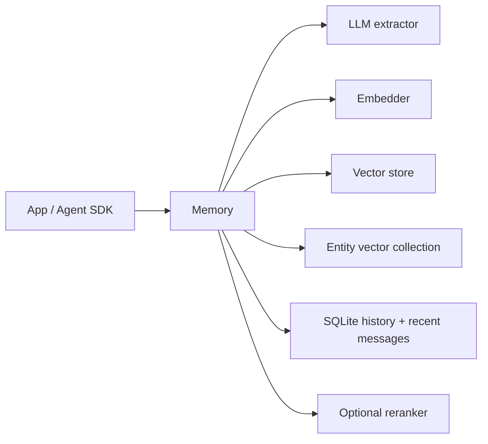

# mem0 Memory System Report

## 1. Executive Summary

`mem0` is a library-first and service-backed personal/agent memory layer. In this checkout, the open-source core is concentrated in the Python SDK under `mem0/mem0/memory/`, with configurable embedders, LLMs, vector stores, rerankers, SQLite history, and entity linking.

The most important recent design choice is the V3 add-only extraction path in `mem0/mem0/memory/main.py`: instead of asking an LLM to ADD/UPDATE/DELETE existing memories, the system extracts new contextual facts in a single LLM call, deduplicates by hash, stores each as a new vector payload, and links extracted entities to memories. The README still references temporal reasoning and managed-platform features, but in the OSS code several temporal/decay operations explicitly raise platform-only errors.

Technically interesting pieces:

- One main class, `Memory`, owns embedding, vector store, LLM, reranker, entity store, and SQLite history.
- Search fuses semantic vector search, keyword/BM25-style scoring where the vector backend supports it, and entity boosts.
- Memory write path now captures both user and assistant messages as extractable evidence.
- Entity records are stored in a separate vector collection and maintain `linked_memory_ids`.
- SQLite stores operation history and recent messages, not the primary memory corpus.

Main risk: facts are LLM-extracted and stored as candidate-looking text but are not represented as uncertain, sourced claims. The system has history metadata, but not a strong trust model.

## 2. Mental Model

The primary memory unit is a text fact stored as a vector-store payload:

- `payload["data"]`: memory text.
- `user_id`, `agent_id`, `run_id`: session/entity scope.
- `actor_id`, `role`, `attributed_to`: attribution metadata when available.
- `hash`: MD5 hash for duplicate suppression.
- `text_lemmatized`: keyword-search support.
- `created_at`, `updated_at`, optional `expiration_date`.

The lifecycle is:

```text
messages -> parse/vision handling -> retrieve nearby existing memories -> LLM additive extraction
-> embed extracted memories -> hash dedupe -> vector insert -> SQLite history -> entity extraction/linking
-> search via semantic/BM25/entity fusion -> optional rerank -> result formatting
```

The V3 path is append-oriented. Updates and deletes still exist as explicit APIs, but the default `add(..., infer=True)` pipeline no longer asks the extractor to rewrite existing facts.

## 3. Architecture

Core files:

- `mem0/mem0/memory/main.py`: main sync memory implementation.
- `mem0/mem0/memory/storage.py`: SQLite history and recent-message store.
- `mem0/mem0/configs/prompts.py`: extraction, update, and procedural-memory prompts.
- `mem0/mem0/utils/scoring.py`: BM25/entity weighting and rank fusion.
- `mem0/mem0/utils/entity_extraction.py`: entity extraction helpers.
- `mem0/mem0/vector_stores/*`: backend adapters.
- `mem0/mem0/reranker/*`: optional rerankers.
- `mem0/mem0/configs/base.py`: config and `MemoryItem` types.

Runtime shape:



The vector store is the authoritative memory store. SQLite tracks `history` and `messages`; it does not store full active memory rows except operation history.

## 4. Essential Implementation Paths

Capture/write:

- `Memory.add()` in `mem0/mem0/memory/main.py`
- `_build_filters_and_metadata()` validates and builds scope metadata.
- `_add_to_vector_store()` handles raw inserts when `infer=False` and the V3 additive LLM pipeline when `infer=True`.
- `_create_memory()` and `_update_memory()` implement direct storage mutations.

Extraction/consolidation:

- `ADDITIVE_EXTRACTION_PROMPT` and `generate_additive_extraction_prompt()` in `mem0/mem0/configs/prompts.py`.
- `_add_to_vector_store()` retrieves nearby existing memories, maps UUIDs to small integer IDs for anti-hallucination, calls `self.llm.generate_response(...)`, parses JSON, embeds new texts, deduplicates, then inserts.

Retrieval/search:

- `Memory.search()` validates query/filters and calls `_search_vector_store()`.
- `_search_vector_store()` performs query preprocessing, semantic search, keyword search where supported, entity lookup/boosting, score fusion, and formatting.
- Optional reranking is invoked in `Memory.search()` through `self.reranker.rerank(...)`.

Context/history:

- `SQLiteManager.save_messages()` stores recent messages per deterministic `session_scope`.
- `_add_to_vector_store()` calls `get_last_messages(..., limit=10)` to resolve references in later extraction.

Delete/update:

- `Memory.update()`, `Memory.delete()`, `Memory.delete_all()`.
- `_remove_memory_from_entity_store()` removes memory IDs from entity links.
- `SQLiteManager.add_history()` records ADD/UPDATE/DELETE history.

Tests:

- `mem0/tests` exists, but the full test map was not deeply audited in this pass.
- The implementation has many defensive fallbacks, but the strongest evidence for behavior came from code, not test execution.

## 5. Memory Data Model

Primary memory rows are vector-store records with payload fields. Scoping is flexible: operations require at least one of `user_id`, `agent_id`, or `run_id`, and those become both storage metadata and query filters.

SQLite tables in `mem0/mem0/memory/storage.py`:

- `history`: `memory_id`, old/new memory text, event, timestamps, deletion flag, actor, role.
- `messages`: `session_scope`, role, content, name, created timestamp.

Entity collection:

- Separate vector collection named from the main collection plus `_entities` or provider-specific separator.
- Payload: `data`, `entity_type`, `linked_memory_ids`, plus session scope fields.

Weakness: the memory record does not explicitly distinguish observation, extracted assertion, verified claim, stale claim, contradiction, or rejected claim. `expiration_date` exists, but trust and uncertainty do not.

## 6. Retrieval Mechanics

The intended retrieval stack is multi-signal:

- Semantic vector similarity on memory text.
- Backend keyword search/BM25 where available.
- Entity matching and boosting using a separate entity collection.
- Optional reranker.
- Metadata filters and advanced filter operators.
- Expiration filtering unless `show_expired=True`.

The code warns when the selected vector backend does not implement `keyword_search`, falling back to semantic-only retrieval. That is a good operational warning because hybrid search claims otherwise silently degrade.

Search risks:

- Scoring behavior depends heavily on vector-store adapter support.
- Entity linking failures are non-fatal and logged; search may silently lose entity boost.
- Expiration is date-based hiding, not a broader temporal reasoning model in OSS.

## 7. Write Mechanics

`add(..., infer=True)` is the critical path:

1. Normalize messages.
2. Parse vision messages if configured.
3. Retrieve nearby existing memories for dedupe/linking context.
4. Build additive extraction prompt with last messages and existing memories.
5. Parse `{"memory": [...]}` response.
6. Batch embed extracted texts.
7. Deduplicate by MD5 hash against existing and current batch.
8. Insert vector records.
9. Batch write history.
10. Batch extract/link entities.
11. Save recent messages.

`infer=False` stores each non-system message as raw memory, preserving role and actor.

The write path is pragmatic and scalable: one LLM call, batch embeddings, batch vector insert, batch entity extraction. The tradeoff is that contradictions are not semantically resolved on write; they become additional memories unless explicit update/delete APIs are used.

## 8. Agent Integration

Surfaces present in this repo:

- Python SDK: `mem0/mem0/memory/main.py`.
- Client/platform layer: `mem0/mem0/client/`.
- CLI under `mem0/cli`.
- OpenMemory app/server under `mem0/openmemory`.
- TypeScript SDK under `mem0/mem0-ts`.
- Agent skill/plugin docs under `mem0/skills` and `mem0/integrations`.

The agent can call add/search through SDK/CLI/plugin surfaces. The default library design is application-controlled: the app decides when to call `add` and `search`, unless wrapped as an agent tool by integrations.

## 9. Reliability, Safety, and Trust

Strengths:

- Validates entity IDs and forbids top-level entity params in newer APIs.
- Hash dedup prevents exact duplicate explosion.
- SQLite writes are locked.
- Entity cleanup is best-effort and isolated from primary delete/update.
- Sensitive config redaction exists for telemetry-related config cloning.

Risks:

- No first-class provenance/trust state for extracted facts.
- LLM extraction includes assistant-generated facts by design; useful for plans/recommendations, risky for hallucinated assistant claims.
- Prompt injection in shared content may cause false extraction unless filtered by upstream prompts.
- Temporal parameters like `timestamp` and `reference_date` are platform-only in OSS, even though docs/README emphasize temporal reasoning.
- Delete semantics depend on vector backend behavior and optional entity cleanup.

## 10. Tests, Evals, and Benchmarks

The README claims benchmark wins and references external evaluation frameworks. In this local analysis, I did not run tests or reproduce benchmark claims.

Evidence in code:

- The implementation has explicit notices for scale, temporal, and decay feature use.
- Many fallbacks are present around embedding, entity linking, vector insert, and parsing.

Missing tests I would want before relying on it:

- Extraction against adversarial assistant/user content.
- Contradiction behavior under add-only V3.
- Hybrid scoring consistency across vector stores.
- Entity boost correctness.
- Expiration and delete consistency.
- Regression tests proving assistant-generated facts do not pollute user memories.

## 11. Patterns Worth Stealing

- Single-call additive extraction with nearby existing memories as dedupe/linking context.
- Separate entity collection with `linked_memory_ids`.
- Hash-based exact dedupe before vector insert.
- Strict entity scoping with at least one of `user_id`, `agent_id`, `run_id`.
- Recent-message side channel for reference resolution without stuffing full chat history into memory.
- Graceful degradation when keyword search or entity linking is unavailable.

## 12. Antipatterns / Risks

- Extracted facts are stored too confidently.
- Add-only is operationally simple but punts contradiction resolution to retrieval or explicit APIs.
- Platform-only temporal/decay features create a doc/code gap for OSS users.
- One main class owns too many responsibilities.
- Entity linking is best-effort but retrieval quality may depend on it.

## 13. Build-vs-Borrow Takeaways

Borrow:

- The V3 additive write pipeline shape.
- Multi-signal retrieval.
- Entity side index.
- Scope validation.
- Batch-first write mechanics.

Avoid copying:

- Treating extracted memories as plain facts with no trust state.
- Letting assistant output become first-class memory without explicit provenance/trust controls.
- Hiding platform-only behavior behind SDK-level parameters.

This design is appropriate for product personalization and high-throughput memory APIs. It is less appropriate when memory correctness, adversarial inputs, or auditability matter more than recall volume.

## 14. Open Questions

- How much of the README's temporal reasoning exists only in the hosted platform?
- How are memory contradictions handled operationally after the V3 add-only shift?
- What are the exact production scoring weights and benchmarks?
- How often does entity extraction materially improve retrieval?
- What deletion guarantees exist across all vector-store backends?

## Appendix: File Index

- Storage/schema: `mem0/mem0/memory/storage.py`, `mem0/mem0/configs/base.py`.
- Write path: `mem0/mem0/memory/main.py`.
- Retrieval path: `mem0/mem0/memory/main.py`, `mem0/mem0/utils/scoring.py`.
- Prompts: `mem0/mem0/configs/prompts.py`.
- Entity extraction: `mem0/mem0/utils/entity_extraction.py`.
- Vector stores: `mem0/mem0/vector_stores/`.
- Rerankers: `mem0/mem0/reranker/`.

