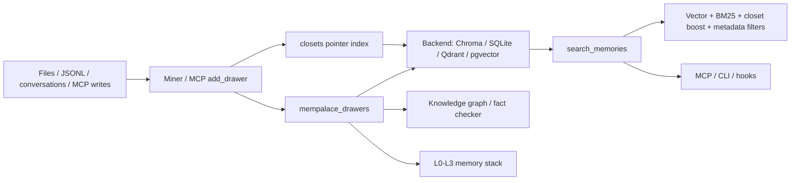

# MemPalace Memory System Report

## 1. Executive Summary

`mempalace` is a local-first, verbatim-memory system for coding agents and personal AI workflows. Its core bet is almost the opposite of `mem0`: do not summarize, paraphrase, or LLM-extract the primary memory. Store original text chunks as "drawers", index them with embeddings and metadata, then retrieve the original evidence.

The implementation is broad and operationally mature for a local memory tool:

- ChromaDB default storage, with backend abstraction for `sqlite_exact`, Qdrant, and pgvector.
- Hybrid retrieval combining vector search, BM25 reranking, metadata filters, closet boosts, and fallback SQLite/FTS paths.
- A "palace" information model: wings, rooms, halls, closets, drawers, tunnels.
- MCP server, CLI, hooks for Claude/Cursor/Antigravity, and a wake-up memory stack.
- Knowledge graph, fact-checking primitives, entity registry, dedup, repair, sync, backups, benchmarks, and conformance tests.
- Explicit operational safety rails: embedder identity checks, stdio protection, mine locks, idempotent writes, collision scans, HNSW repair warnings, backend mismatch checks.

The most important design distinction: MemPalace treats verbatim stored text as the authoritative memory layer. Structured layers such as closets and the knowledge graph are indexes or navigation aids, not replacements for the source memory.

Main risk: the system stores large amounts of raw text. That preserves evidence and avoids extraction loss, but it shifts the hard problems to retrieval quality, privacy/deletion, corpus hygiene, and context assembly.

## 2. Mental Model

Primary units:

- `Palace`: local memory root.
- `Wing`: project/person/top-level scope.
- `Room`: topic within a wing.
- `Drawer`: verbatim text chunk. This is the primary searchable evidence.
- `Closet`: compact index/pointer layer that points back to drawer IDs.
- `Hall`: conceptual category inside a wing.
- `Tunnel`: graph connection between related rooms/wings.
- `KG triple`: temporal entity relation stored in local SQLite.

Lifecycle:

```text
files / conversations / manual MCP writes
-> normalize and chunk verbatim text
-> assign wing + room + metadata
-> deterministic drawer IDs
-> batch upsert into backend
-> emit closet pointer lines
-> optional graph / hallway / tunnel computation
-> search drawers directly
-> boost/rerank with BM25 + closets + metadata + recency
-> return verbatim drawer context
```

The system's answer to "what should be remembered?" is conservative: remember the original content first, then let retrieval decide what matters later.

## 3. Architecture

Core files:

- `mempalace/mempalace/palace.py`: shared collection access, backend resolution, embedder identity, closet helpers, mine locks.
- `mempalace/mempalace/miner.py`: project/file mining, chunking, room detection, drawer writes, closet generation.
- `mempalace/mempalace/convo_miner.py`: conversation mining.
- `mempalace/mempalace/searcher.py`: CLI/programmatic search, hybrid ranking, FTS/BM25 fallback.
- `mempalace/mempalace/mcp_server.py`: MCP tools for search, add/delete/update drawers, mine, graph/KG, diary, sync, status.
- `mempalace/mempalace/backends/base.py`: typed backend contract.
- `mempalace/mempalace/backends/chroma.py`: default Chroma backend.
- `mempalace/mempalace/backends/sqlite_exact.py`: local exact-vector backend.
- `mempalace/mempalace/backends/qdrant.py`, `pgvector.py`: external backend adapters.
- `mempalace/mempalace/layers.py`: 4-layer wake-up/recall/search stack.
- `mempalace/mempalace/knowledge_graph.py`: temporal SQLite entity-relation graph.
- `mempalace/mempalace/fact_checker.py`: conservative contradiction/name-confusion checks.
- `mempalace/mempalace/dedup.py`: near-duplicate drawer cleanup.
- `mempalace/mempalace/repair.py`: index/schema/extraction repair utilities.

Architecture:



The backend abstraction is unusually explicit. `BaseCollection` and `BaseBackend` define typed result shapes, error classes, health status, maintenance hooks, embedder identity, and isolation contracts.

## 4. Essential Implementation Paths

### Collection and Backend Resolution

`get_collection()` in `palace.py` resolves the configured backend, opens the collection, wraps backends that require explicit embeddings, and enforces embedder identity. This is a critical operational guardrail: a palace indexed with one embedding model should not be silently searched with another.

The backend contract in `backends/base.py` defines:

- `PalaceRef` with `id`, `local_path`, and optional `namespace`.
- backend isolation rules;
- typed `QueryResult` / `GetResult`;
- `EmbedderIdentity`;
- mismatch and capability errors;
- maintenance result semantics.

### Mining and Drawer Writes

`mine()` in `miner.py` acquires a palace-level lock, then `_mine_impl()` scans files, opens drawer and closet collections, and calls `process_file()`.

`process_file()`:

- skips already-mined files by metadata/mtime;
- reads text without following symlinks;
- detects the room;
- chunks text with line metadata;
- enforces a max chunks per file safety rail;
- locks the source file;
- deletes stale drawers for modified files;
- builds deterministic drawer IDs with `make_drawer_id_from_chunk()`;
- batch-upserts documents and metadata;
- collision-checks IDs;
- builds closet pointer lines and upserts them.

This is not a casual ingest path. It is engineered around concurrent agents, large files, HNSW/chroma update hazards, generated-file caps, and reproducible IDs.

### MCP Manual Writes

`tool_add_drawer()` in `mcp_server.py` is the hot path for agent-supplied memory. It sanitizes wing/room/content/source metadata, computes a deterministic content-derived logical drawer ID, logs a WAL event, checks idempotency, and writes either a single row or chunked physical rows with `parent_drawer_id`.

Important details:

- oversized content is chunked before embedding;
- batch upsert is all-or-nothing from the caller's perspective;
- the last chunk is probed after write to verify readability;
- chunked logical drawers return both `drawer_id` and `chunk_ids`;
- delete paths handle logical chunk groups.

### Search

`search_memories()` in `searcher.py` is the core retrieval implementation.

It:

- validates candidate strategy;
- can route to vector-disabled SQLite/BM25 fallback;
- opens the drawer collection;
- applies wing/room/source metadata filters;
- queries drawers directly as the retrieval floor;
- queries closets separately as a rank signal;
- applies rank-based closet boosts, never as a hard gate;
- computes effective distance;
- enriches closet-boosted hits with neighboring drawer chunks;
- returns source path, created/authored timestamps, similarity, raw/effective distance, and match mode.

The comment in `searcher.py` is a good design rule: closets are a ranking signal, never a gate. This avoids the failure mode where a weak extracted index hides verbatim evidence that direct drawer search would have found.

### Hybrid Ranking

`_hybrid_rank()` combines backend vector similarity with BM25 over candidates:

- vector similarity is derived from backend-declared metric;
- BM25 is Okapi-style over the candidate set;
- BM25 is normalized before fusion;
- authored time breaks exact score ties;
- vector-unknown candidates can still rank by BM25.

This is a pragmatic hybrid retrieval implementation. It is more careful than the common "vector search and hope" baseline.

### Context Assembly

`layers.py` implements a 4-layer stack:

- L0 identity: `~/.mempalace/identity.txt`.
- L1 essential story: top drawers grouped by room, capped around 3,200 chars.
- L2 on-demand recall: wing/room-filtered drawers.
- L3 deep search: semantic search.

This stack is simpler than Letta's runtime memory but useful: bounded startup context plus explicit deeper retrieval.

### Knowledge Graph and Fact Checking

`knowledge_graph.py` stores entities and temporal triples in SQLite with WAL. Triples include:

- `subject`, `predicate`, `object`;
- `valid_from`, `valid_to`;
- `confidence`;
- source closet/file/drawer provenance;
- adapter name.

`fact_checker.py` is conservative. It flags:

- similar-name confusion against known entities;
- relationship mismatch against current KG facts;
- stale facts when matching triples have expired.

The docs explicitly say contradiction detection is not fully integrated end-to-end in the MCP workflow. Treat the KG/fact checker as promising primitives, not a finished trust layer comparable to Verel.

## 5. Data Model and Storage Semantics

Drawer metadata includes fields such as:

- `wing`
- `room`
- `source_file`
- `chunk_index`
- `parent_drawer_id` for logical chunk groups
- `filed_at`
- `authored_at`
- source mtime/content date
- line start/end
- `normalize_version`
- extracted entities/hall metadata
- ID recipe

Important storage properties:

- The primary memory is the document text itself.
- Deterministic IDs make re-mining and duplicate checks tractable.
- Modified files are purged and reinserted to avoid unsafe vector update paths.
- Collections record embedder identity to prevent model-swap corruption.
- External backends are opt-in; local Chroma is default.
- Namespace isolation is explicitly part of the backend contract for remote backends.

## 6. Retrieval and Ranking

MemPalace's retrieval has several layers:

1. Direct drawer vector search.
2. Candidate BM25 reranking.
3. Optional lexical candidate union where backend supports it.
4. Closet lookup for source-level boost.
5. Metadata filters for wing, room, source file.
6. Neighbor chunk expansion.
7. SQLite/FTS fallback when vector/HNSW is unavailable or unsafe.

This is one of the better retrieval implementations in the workspace because it assumes vector retrieval will fail in boring ways:

- exact terms matter;
- source-level match can point to a better neighboring chunk;
- HNSW indexes can diverge or become unsafe;
- backend distance metrics must be declared;
- adding lexical candidates should not silently bypass distance filters.

## 7. Update, Correction, and Deletion

Update/deletion is mostly storage-level, not epistemic:

- `tool_delete_drawer()` deletes a logical drawer or chunk group by ID.
- `tool_delete_by_source()` removes mined content from a source file.
- `tool_update_drawer()` can update content and metadata.
- `dedup.py` removes near-duplicate drawers by source group.
- `repair.py` handles index/schema recovery.

Contradiction handling is not a central write-time memory policy. The knowledge graph has temporal invalidation, and the fact checker can detect some relationship/stale conflicts, but normal drawer memory remains verbatim evidence. This is appropriate for its design: it avoids rewriting memory into false certainty, but it also means the system needs retrieval and context consumers that can reason over conflicting raw evidence.

## 8. Trust, Provenance, and Safety

Strengths:

- Verbatim evidence is retained.
- Drawers link to source file, chunk, authored/filed time, line spans, parent IDs.
- KG triples carry source fields.
- MCP server has read-only mode.
- Content and metadata are sanitized.
- The MCP server protects JSON-RPC stdio from dependency stdout pollution.
- Local-first default keeps data on machine unless a remote backend is chosen.

Weaknesses:

- There is no first-class trust state like candidate/verified/rejected for drawers.
- Raw recalled text is not inherently fenced as untrusted data in the same way as Verel's recall renderer.
- Fact-checking is conservative and partial.
- Large verbatim stores increase privacy/deletion burden.

Compared with extraction-first systems, MemPalace preserves provenance better because the source content is the memory. Compared with Verel, it has less epistemic machinery.

## 9. Extensibility and Operations

MemPalace is strong operationally:

- Backend registry and conformance tests.
- CLI, MCP stdio/HTTP, Docker, hooks, commands, skills, and integrations.
- Repair/migrate/sync/export/backups.
- Benchmarks and benchmark-result artifacts.
- Embedder identity and dimension checks.
- Palace locks and per-file mine locks.
- HNSW capacity and metric checks.
- WAL logging for MCP writes.

This is a system built by people who have hit local-agent failure modes in practice.

## 10. Tests and Evidence

The repo has broad test coverage:

- search and hybrid candidate union;
- backends and backend conformance;
- Chroma/Qdrant/pgvector/sqlite exact;
- MCP server and HTTP transport;
- mining, conversation mining, format mining;
- hooks for Claude/Cursor/Antigravity;
- locks, repair, sync, backups;
- knowledge graph, fact checker, entity registry;
- line numbers, authored-at backfill, dedup, collision scan;
- benchmarks.

The benchmark docs make strong claims, but also include caveats about metric comparability and overfitting. The most important internal result for design purposes is not the headline score; it is the empirical argument that verbatim storage plus good retrieval is a strong baseline before adding LLM extraction.

## 11. Fit for Agent Memory

Best fit:

- local coding-agent memory;
- Claude/Cursor/Gemini-style session retention;
- project knowledge recall;
- offline/private memory;
- evidence-preserving retrieval;
- benchmarked retrieval experiments.

Less ideal:

- systems requiring compact canonical user profiles;
- cases where the application needs verified facts rather than raw evidence;
- hosted multi-user SaaS memory without additional privacy/tenant controls;
- small agents that need a minimal memory primitive.

MemPalace is closest to `engram` in local-first spirit, but much broader and more retrieval/benchmark heavy. It is closest to `verel` in caring about correctness, but chooses preservation of evidence over explicit trust-state promotion.

## 12. Patterns and Antipatterns

Patterns worth borrowing:

- Store raw evidence before extracting anything.
- Make metadata scopes human-legible.
- Use lexical and vector retrieval together.
- Treat extracted/indexed summaries as boosts, not gates.
- Record embedder identity with the index.
- Use deterministic IDs for reproducible mining.
- Add repair and fallback paths for local vector stores.
- Validate writes by reading after write.
- Include benchmark fixtures and failure-analysis notes.

Antipatterns avoided:

- Throwing away source context after fact extraction.
- Vector-only retrieval.
- Silent embedding-model swaps.
- Agent-facing MCP tools that corrupt stdio.
- Concurrent mining without locks.

Remaining risks:

- Raw memory can become huge and noisy.
- Retrieval can surface contradictory evidence without resolving it.
- Context assembly may still inject raw text as if it were safe instruction unless callers fence it.
- Deletion must chase drawers, closets, KG triples, backups, and remote backends.

## 13. Build-vs-Borrow Takeaways

Borrow aggressively:

- verbatim drawer baseline;
- hybrid retrieval;
- closet-as-boost-not-gate principle;
- embedder identity checks;
- deterministic drawer IDs;
- MCP stdio hardening;
- local repair/fallback tooling;
- benchmark discipline.

Do not copy blindly:

- the full palace metaphor if your users do not need it;
- Chroma-specific recovery paths if using another store;
- raw-everything retention without privacy controls;
- claims about retrieval benchmarks as if they prove end-to-end answer quality.

For your own memory system, MemPalace is the strongest reminder that extraction is not always the right first step. A serious system should first prove that raw evidence plus hybrid retrieval is insufficient before adding lossy LLM memory synthesis.

## 14. Open Questions

- How well does the raw-drawer approach behave at very large personal-memory scale?
- What is the best UX for resolving contradictory drawers?
- How integrated will KG/fact-checking become with MCP write/search flows?
- How expensive is hybrid candidate union on each backend at scale?
- How reliably do hooks capture all important agent context across tools?
- What is the deletion story across drawers, closets, KG, backups, and sync?

## Appendix: File Index

- Core collection/backend access: `mempalace/mempalace/palace.py`.
- Backend contract: `mempalace/mempalace/backends/base.py`.
- Default backend: `mempalace/mempalace/backends/chroma.py`.
- Other backends: `mempalace/mempalace/backends/sqlite_exact.py`, `qdrant.py`, `pgvector.py`.
- Mining: `mempalace/mempalace/miner.py`, `mempalace/mempalace/convo_miner.py`, `mempalace/mempalace/format_miner.py`.
- Search: `mempalace/mempalace/searcher.py`.
- MCP server: `mempalace/mempalace/mcp_server.py`.
- Context stack: `mempalace/mempalace/layers.py`.
- Graph: `mempalace/mempalace/palace_graph.py`, `mempalace/mempalace/hallways.py`, `mempalace/mempalace/knowledge_graph.py`.
- Fact checking: `mempalace/mempalace/fact_checker.py`.
- Dedup/repair/sync: `mempalace/mempalace/dedup.py`, `repair.py`, `sync.py`.
- Benchmarks: `mempalace/benchmarks/`.
- Tests: `mempalace/tests/`.

