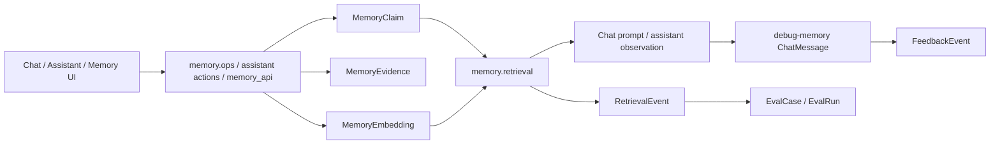

# RainBox Memory System Report

## 1. Executive Summary

`rainbox` is a local-model personal assistant application with a first-class memory subsystem. It is not a standalone memory library like `mem0`, not a local corpus retriever like `mempalace`, and not a verification framework like `verel`. It is an operator-facing assistant platform where memory is tied into chat, assistant actions, review UI, telemetry, feedback, and evals.

The core memory design is explicit and fairly mature:

- Canonical beliefs live in Postgres as `MemoryClaim`.
- Provenance is stored separately as appendable `MemoryEvidence` rows.
- Embeddings are auxiliary `MemoryEmbedding` rows, not the source of truth.
- Claims have status, scope, sensitivity, confidence, expiry, and supersession.
- Retrieval hard-filters before ranking, then blends vector similarity, Postgres full-text rank, and entity boosts.
- Memory use is auditable through `debug-memory` chat rows and `RetrievalEvent`.
- User feedback can be linked back to retrieval events and promoted into eval cases.
- A `/memory` review page supports lifecycle actions with optimistic concurrency guards.

The most interesting part is not the ranker itself. It is the operational loop around memory:

```text
claim/evidence -> retrieval -> prompt injection/action observation
-> debug row + retrieval events -> feedback -> eval case -> gated change
```

Main risk: RainBox has strong provenance and observability, but it is still mostly claim-based memory. It does not preserve full verbatim evidence like MemPalace, and it does not enforce Verel-style trust/promotion rigor for every model-inferred claim unless the surrounding workflow uses the candidate/confirm path consistently.

## 2. Mental Model

Primary memory unit:

```python
MemoryClaim(
    scope="global|agent|room|project",
    kind="fact|preference|project_decision|procedure|episode_summary",
    subject=...,
    predicate=...,
    object=...,
    text=...,
    confidence=0.0..1.0,
    status="candidate|active|superseded|rejected|expired",
    sensitivity="public|private|secret",
    supersedes_uuid=...,
    expires_at=...
)
```

Evidence is separate:

```python
MemoryEvidence(
    memory_uuid=...,
    provenance="observed_from_source|inferred_by_model|confirmed_by_user|imported_from_transcript",
    source_type="chat_message|journal|file|api|manual|transcript",
    source_id=...,
    excerpt=...,
    created_by_uuid=...
)
```

Retrieval lifecycle:

```text
user turn / assistant action
-> build query
-> hard filter active, non-expired, allowed sensitivity, matching scope
-> rank by vector + full-text + subject/object entity boost
-> format memory context
-> inject into chat prompt or assistant action observation
-> write RetrievalEvent and/or debug-memory row
```

Write lifecycle:

```text
explicit remember / assistant memory write / review UI
-> create or mutate MemoryClaim
-> add MemoryEvidence
-> refresh or prune MemoryEmbedding
-> expose link to /memory review UI
```

## 3. Architecture

Core files:

- `rainbox/source/db/models.py`: SQLAlchemy models for `MemoryClaim`, `MemoryEvidence`, `MemoryEmbedding`, `RetrievalEvent`, `FeedbackEvent`.
- `rainbox/source/db/memory.py`: claim/evidence CRUD, supersede/reject/activate/reactivate, stale-write guards, detail assembly.
- `rainbox/source/memory/retrieval.py`: legacy lexical retrieval, hybrid retrieval, prompt formatting, telemetry, debug-memory rows.
- `rainbox/source/memory/ops.py`: explicit user commands: remember, forget, confirm, correct, recall, explain, used.
- `rainbox/source/memory/embeddings.py`: embedding freshness, backfill, prune, sync.
- `rainbox/source/agents/assistant.py`: assistant `query_memory`, `remember`, `forget_memory`, `activate_memory`, undo actions.
- `rainbox/source/agents/assistant_writes.py`: confirm-tier write-intent execution and undo.
- `rainbox/source/agents/chat_context.py`: profile + seed facts + hybrid memory block assembly.
- `rainbox/source/user_profile/retrieval.py`: query-independent operator profile digest.
- `rainbox/source/webapp/memory_api.py`: JSON API for memory review/lifecycle actions.
- `rainbox/source/webapp/memory_views.py`: `/memory` review page shell.
- `rainbox/source/docs/memory-architecture.md`: accurate high-level design doc.
- `rainbox/source/docs/relevance-telemetry.md`: retrieval event semantics.

Architecture:



## 4. Essential Implementation Paths

### Schema

`MemoryClaim` in `db/models.py` is the canonical belief row. Constraints enforce allowed values for scope, kind, status, sensitivity, and confidence range.

Important fields:

- `scope`: `global`, `agent`, `room`, `project`.
- `kind`: `fact`, `preference`, `project_decision`, `procedure`, `episode_summary`.
- `status`: `candidate`, `active`, `superseded`, `rejected`, `expired`.
- `sensitivity`: `public`, `private`, `secret`.
- `subject`, `predicate`, `object`: optional structured claim form.
- `supersedes_uuid`: correction lineage.
- `expires_at`: retrieval-time staleness.

`MemoryEvidence` is deliberately not a mutable provenance field on the claim. Multiple evidence rows can accumulate, so a model-inferred candidate can later receive user confirmation without erasing its origin.

`MemoryEmbedding` is separate and unique by `(memory_uuid, model_name, text_hash)`. This lets embeddings be rebuilt without corrupting claims.

### User Command Writes

`memory/ops.py` parses explicit commands before the Q&A path:

- `remember that ...`
- `forget ...`
- `confirm that ...`
- `correct that OLD -> NEW`
- `what do you remember?`
- `why do you remember ...`
- `which memories did you use?`

Handlers:

- `_handle_remember()` creates an active global/private fact with `confirmed_by_user` evidence and refreshes its embedding.
- `_handle_forget()` marks a matching active claim rejected and prunes embedding.
- `_handle_confirm()` activates or re-confirms a candidate/active claim.
- `_handle_correct()` supersedes the old claim and creates a new active claim.
- `_handle_explain()` prints evidence rows.
- `_handle_used()` reads the latest `debug-memory` row for the room.

This path is deterministic and works before LM Studio, embeddings, pgvector, or Q&A registry are initialized.

### Assistant Memory Actions

`agents/assistant.py` defines memory capabilities:

- `query_memory`: read action.
- `remember`: log-and-undo write.
- `forget_memory`: log-and-undo write.
- `activate_memory`: confirm-tier write.
- internal `reject_memory_candidate` and `reactivate_memory` undo actions.

`_action_query_memory()` merges curated seed memories with dynamic memory claims. It returns UUIDs in the observation so later actions can target exact memories.

`_action_remember()` currently creates an active room-scoped private fact when the operator explicitly asked to remember it. The capability description still says "candidate", but the implementation and tests say explicit remember goes active immediately and is undoable.

`_action_activate_memory()` is confirm-tier. It is not executed inline by the assistant loop; it runs only after an approved `assistant_write_intent`.

`agents/assistant_writes.py` is the confirm-tier gate. It verifies the intent is still `proposed`, verifies payload hash, transitions through `confirmed -> executing -> completed/failed`, and executes against the stored payload.

### Retrieval

There are two retrieval paths in `memory/retrieval.py`.

Legacy `retrieve_memories()`:

- token-overlap matching;
- active only;
- excludes expired and secret claims by default;
- sorts by scope tier, confidence, recency;
- used originally for chat memory.

Hybrid `retrieve_memories_hybrid()`:

- calls `hard_filtered_claims()` first;
- excludes secret unless explicitly allowed;
- excludes expired claims;
- enforces scope before ranking;
- excludes `project` scope until project context exists;
- scores with vector similarity, Postgres full-text rank, and subject/object entity boost;
- breaks ties by scope tier, confidence, recency;
- writes `RetrievalEvent` rows when requested.

Weights:

```text
vector:   0.55
fulltext: 0.30
entity:   0.15
```

The best design choice is "filter before rank". Forbidden memories never enter the candidate set.

### Embeddings

`memory/embeddings.py` uses `embeddinggemma:300m`, 768 dimensions. The embedding text is claim text plus optional subject/predicate/object.

The embedding model:

- is lazy-loaded;
- is best-effort;
- never blocks lexical retrieval;
- refreshes when active claims change;
- prunes when claims are rejected/superseded/expired;
- supports backfill/sync.

This is a good separation: vector indexing is an optimization, not durable truth.

### Prompt Injection

`agents/chat_context.py` builds the chat context block:

1. operator profile block from `user_profile.retrieval`;
2. curated seed facts;
3. hybrid memory block.

`user_profile/retrieval.py` builds a query-independent operator profile from active self-model claims. It reuses `hard_filtered_claims()` so secret/expired/out-of-scope/candidate claims cannot leak through a divergent filter. It records `considered` and `injected` retrieval events.

`format_memory_context()` renders compact lines like:

```text
Relevant remembered facts:
- [preference, private, confirmed_by_user] User prefers concise technical answers.
```

The context is compact and provenance-labeled, but it is not fenced as untrusted data as explicitly as Verel's recall renderer.

### Memory Audit

`record_memory_use()` posts `ChatMessage(kind="debug-memory", content_type="json")` containing:

- query;
- journal ID;
- memory UUIDs;
- retrieval reason;
- confidence;
- provenance labels.

This supports the "which memories did you use?" command and makes retrieval visible in the chat record.

### Review UI

`webapp/memory_api.py` and `memory_views.py` implement a real review surface:

- list all claims with derived fields;
- mask secret claim text in list view;
- reveal detail endpoint;
- show evidence, retrieval events, lineage, embedding freshness;
- activate/reject/reactivate/correct/sensitivity/expiry actions;
- use `expected_updated_at` guards;
- return HTTP 409 for stale writes.

This is a major difference from most repos: memory is not just an API; it is inspectable and operable.

## 5. Data Model and Storage Semantics

Storage is Postgres via SQLAlchemy and pgvector.

`memory_claim` is the source of truth. `memory_embedding` is auxiliary. `memory_evidence` is append-style provenance.

Correction model:

- reject: mark claim `rejected`, keep evidence.
- correct: mark old claim `superseded`, create new claim with `supersedes_uuid`.
- reactivate: move rejected/expired claim back to active with confirmation evidence.
- expiry: active claims with past `expires_at` are excluded even if status remains active.

Sensitivity model:

- `secret`: excluded from normal retrieval and masked in list UI.
- `private`: retrievable but marked in prompt context.
- `public`: retrievable.

Scope model:

- `room` beats `agent`, which beats global in ranking.
- `project` is excluded by `hard_filtered_claims()` until project context exists.

## 6. Retrieval and Ranking

RainBox's retrieval is conservative:

- allowed claims only;
- small capped result sets;
- deterministic fallback;
- hybrid rank only after hard filtering;
- missing embeddings degrade gracefully;
- result provenance is carried into prompt formatting;
- use is logged.

Hybrid retrieval is not especially novel, but its integration is good:

- vector signal from pgvector;
- lexical/full-text signal from Postgres;
- entity signal from subject/object fields;
- confidence/scope/recency tie breakers;
- telemetry on retrieved/injected/used/downvoted events.

The main limitation is that claim extraction/creation quality is outside the ranker. A wrong active claim with high confidence can be retrieved cleanly.

## 7. Update, Correction, and Deletion

RainBox has stronger correction semantics than most practical app repos:

- active vs candidate vs rejected vs superseded vs expired;
- correction lineage;
- explicit evidence rows;
- user confirmation evidence;
- UI actions with optimistic concurrency;
- undo for some assistant writes;
- embedding prune on non-active status.

It does not implement Verel-style rejected-value tombstones that block future laundering by subject/predicate. It does, however, retain rejected and superseded rows for inspection.

## 8. Trust, Provenance, and Safety

Strengths:

- Evidence is separate and appendable.
- User-confirmed facts are distinguishable from inferred/imported facts.
- Secret memories are filtered before rank.
- Retrieval telemetry is append-only and target typed.
- Feedback/downvotes can be connected to same-turn memory use.
- Assistant confirm-tier writes use stored payload hashes.
- Memory review API has stale-write guards.

Weaknesses:

- Prompt rendering labels provenance but does not strongly fence memory as untrusted data.
- Explicit remember goes active immediately, so bad user/operator input can become steering context.
- No strong contradiction detection or rejected-value guard.
- Claim rows are compact beliefs; original full evidence may be only excerpt/source ID, not always full verbatim context.

RainBox is strongest at "operator can inspect and govern memory", not at automated truth verification.

## 9. Extensibility and Operations

Operationally useful pieces:

- `/memory` review page.
- `memory/api` lifecycle endpoints.
- embedding backfill/sync/prune.
- retrieval telemetry.
- feedback events.
- eval case/run/compare/optimizer loop.
- assistant run/step trace.
- seed memory overlay.
- user profile digest.

This is one of the few repos where memory behavior is connected to product feedback and regression gates.

## 10. Tests and Evidence

Relevant tests include:

- `rainbox/source/db/test_memory.py`
- `rainbox/source/db/test_memory_embedding.py`
- `rainbox/source/memory/test_retrieval.py`
- `rainbox/source/memory/test_hybrid_retrieval.py`
- `rainbox/source/memory/test_embeddings.py`
- `rainbox/source/memory/test_ops.py`
- `rainbox/source/agents/test_chat_memory.py`
- `rainbox/source/agents/test_chat_context.py`
- `rainbox/source/agents/test_assistant_actions.py`
- `rainbox/source/agents/test_assistant_writes.py`
- `rainbox/source/agents/test_assistant_profile.py`
- `rainbox/source/webapp/test_memory_api.py`
- `rainbox/source/webapp/test_memory_views.py`
- eval/feedback/retrieval-event tests across `source/db`, `source/evals`, and `source/agents`.

The test surface is broad and implementation-specific, which increases confidence that this is an actively used subsystem rather than a design sketch.

## 11. Fit for Agent Memory

Best fit:

- personal assistant with operator-visible memory;
- local-model assistant with Postgres;
- memory that needs review, correction, feedback, and eval loops;
- assistant action systems with read/write capability tiers;
- applications where "which memory did you use?" matters.

Less ideal:

- lightweight library embedding;
- local-only file/corpus recall without a database app;
- rigorous epistemic verification;
- raw transcript preservation as primary memory.

RainBox is closest to Letta in being an application/runtime memory integration, closest to Honcho in treating memory as observable product behavior, and closest to Verel in having lifecycle states. Its distinctive contribution is the review/telemetry/eval loop around claims.

## 12. Patterns and Antipatterns

Patterns worth borrowing:

- Claim/evidence split.
- Embeddings as auxiliary index, not source of truth.
- Filter before rank.
- Sensitivity filtering before retrieval.
- Correction via supersession instead of overwrite.
- Debug rows explaining which memories were injected.
- Retrieval events with `retrieved`, `used`, `downvoted`, `considered`, `injected`.
- Feedback-to-eval loop.
- Stale-write guards in memory review UI.
- Confirm-tier writes for high-impact assistant mutations.

Antipatterns avoided:

- Vector-only retrieval.
- Mutating provenance in place.
- Hiding memory use from the operator.
- Treating downvotes as automatic deletion.
- Allowing project-scoped memories to leak without project context.

Remaining risks:

- Active wrong claims can still steer the model.
- A compact claim can lose nuance from the original source.
- Some documentation/capability wording lags implementation details.
- Prompt-injection hardening of recalled memory is weaker than Verel.
- No full answer attribution yet; `used` means entered context.

## 13. Build-vs-Borrow Takeaways

Borrow:

- Data model shape: claim, evidence, embedding, retrieval event.
- Lifecycle statuses.
- Sensitivity and scope filters before ranking.
- Memory review UI with optimistic concurrency.
- Retrieval telemetry and feedback/eval integration.
- Confirm-tier write-intent pattern.

Do not copy blindly:

- Immediate active memory for every "remember" command if your trust boundary is weaker.
- Claim-only memory if you need source-preserving recall.
- Full application stack if you only need a backend service.

RainBox is worth studying if you want memory to be an inspectable operator workflow, not just a retrieval function.

## 14. Open Questions

- How are model-inferred candidate memories created in normal operation?
- How often does the operator review candidate/active memories?
- Should prompt-injected memory be fenced more explicitly as untrusted context?
- How should project-scoped claims be matched once project context is available?
- Can downvote telemetry identify stale/wrong memories reliably enough to propose review tasks?
- How much original source context is enough for high-stakes corrections?

## Appendix: File Index

- Models: `rainbox/source/db/models.py`.
- Claim/evidence operations: `rainbox/source/db/memory.py`.
- Retrieval: `rainbox/source/memory/retrieval.py`.
- User commands: `rainbox/source/memory/ops.py`.
- Embeddings: `rainbox/source/memory/embeddings.py`.
- Chat context assembly: `rainbox/source/agents/chat_context.py`.
- Assistant memory actions: `rainbox/source/agents/assistant.py`.
- Confirm-tier writes: `rainbox/source/agents/assistant_writes.py`.
- User profile digest: `rainbox/source/user_profile/retrieval.py`.
- Memory API/UI: `rainbox/source/webapp/memory_api.py`, `rainbox/source/webapp/memory_views.py`, `rainbox/source/static/memory.js`.
- Telemetry: `rainbox/source/db/feedback.py`, `rainbox/source/docs/relevance-telemetry.md`.
- Design docs: `rainbox/source/docs/memory-architecture.md`.
- Tests: `rainbox/source/**/test_*memory*.py`, `rainbox/source/agents/test_chat_context.py`, `test_assistant_writes.py`, `test_assistant_profile.py`.

