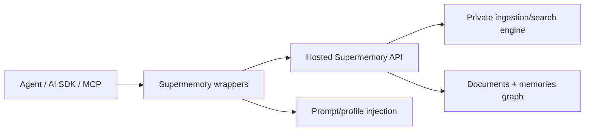

# Supermemory Memory System Report

## 1. Executive Summary

`supermemory` is a memory/context product monorepo. In this checkout, the core hosted ingestion, extraction, indexing, and retrieval engine does not appear to be fully present. What is present and inspectable:

- Public validation schemas for documents, chunks, spaces, memory entries, relations, requests, and projects.
- SDK/tool wrappers for AI SDK, OpenAI, Vercel, Mastra, VoltAgent, Claude-memory style integrations.
- MCP server that wraps the hosted API.
- Memory graph visualization package.
- Web app and docs.

So this report is necessarily about the open implementation surface, not the private backend. The repo is still useful because the schemas reveal a lot about Supermemory's internal model: documents, chunks, memory entries, versioning, parent/root chains, update/extend/derive relations, forgetting, static/inferred flags, spaces/container tags, and profile/search APIs.

## 2. Mental Model

The visible memory model has two coupled layers:

- Documents/chunks: uploaded or connected content, extracted/chunked/embedded/indexed.
- Memory entries: inferred or static facts connected to spaces and source documents.

Important entities from `supermemory/packages/validation/schemas.ts`:

- `Document`: content, summary, type, processing status, stats, summary embeddings.
- `Chunk`: document chunk with content, embedded content, embedding, matryoshka embedding.
- `Space`: scoped container with `containerTag`, visibility, owner, content text index.
- `MemoryEntry`: memory text, version, latest flag, parent/root chain, relations, source count, inference/forgotten/static flags, embeddings.
- `MemoryDocumentSource`: links memory entries to source documents with relevance score.

Lifecycle inferred from schemas and clients:

```text
API add/document/connectors -> document queued/extracting/chunking/embedding/indexing/done
-> memory entries inferred or statically saved
-> search/profile APIs return memories, documents, chunks, summaries, related context
-> clients inject profile/search results into agent prompts
-> forget API marks/removes matching memory
```

## 3. Architecture

Visible code areas:

- `supermemory/packages/validation/schemas.ts`: internal/domain schema types.
- `supermemory/packages/validation/api.ts`: public API request/response schemas.
- `supermemory/packages/ai-sdk/src/tools.ts`: AI SDK `searchMemories` and `addMemory` tools.
- `supermemory/apps/mcp/src/server.ts`: Cloudflare MCP agent exposing memory, recall, context, profile/resources, graph UI.
- `supermemory/apps/mcp/src/client.ts`: SDK wrapper for create/forget/search/profile/documents.
- `supermemory/packages/tools/src/shared/context.ts`: profile/search prompt injection.
- `supermemory/packages/tools/src/shared/memory-client.ts`: client construction and API-key validation.
- `supermemory/packages/memory-graph/src/*`: graph visualization of documents/memory relations.

Runtime shape from visible code:



## 4. Essential Implementation Paths

Add memory through AI SDK:

- `supermemoryTools()` in `packages/ai-sdk/src/tools.ts`.
- `addMemory.execute()` calls `client.add({ content: memory, containerTags })`.
- Scoping is via `projectId -> sm_project_<id>` or explicit `containerTags`.

Search through AI SDK:

- `searchMemories.execute()` calls `client.search.execute({ q, containerTags, limit, chunkThreshold: 0.6, includeFullDocs })`.

MCP memory tool:

- `SupermemoryMCP.init()` in `apps/mcp/src/server.ts`.
- Registers `memory` tool with `action: save | forget`.
- `handleMemory()` calls `SupermemoryClient.createMemory()` or `forgetMemory()`.

MCP recall tool:

- `recall` tool registered in `apps/mcp/src/server.ts`.
- Calls API through `SupermemoryClient` and formats memories through `formatMemories`.

MCP context/profile:

- `context` prompt in `apps/mcp/src/server.ts`.
- Fetches profile and formats stable preferences plus recent activity.
- `packages/tools/src/shared/context.ts` does similar prompt injection for framework integrations through `/v4/profile`.

Forget flow:

- `apps/mcp/src/client.ts`.
- `forgetMemory()` tries exact `client.memories.forget({ content })`.
- On 404, falls back to semantic search with threshold `0.85`, then forgets by ID if an actual memory result matched.

Graph:

- `apps/mcp/src/server.ts` registers `memory-graph` and `fetch-graph-data`.
- `packages/memory-graph` renders documents and memory entries.

## 5. Memory Data Model

Visible schema details:

`Document`:

- `id`, `customId`, `contentHash`, `orgId`, `userId`, `connectionId`.
- Content fields: `title`, `content`, `summary`, `url`, `source`, `type`, `status`.
- Processing metadata: extraction/chunking/embedding/indexing states.
- `summaryEmbedding`, `summaryEmbeddingNew`.

`Chunk`:

- `documentId`, content, embedded content, position, metadata.
- Standard and matryoshka embeddings.

`MemoryEntry`:

- `memory`, `spaceId`, `orgId`, `userId`.
- `version`, `isLatest`, `parentMemoryId`, `rootMemoryId`.
- `memoryRelations`: `updates`, `extends`, `derives`.
- `sourceCount`, `isInference`, `isForgotten`, `isStatic`.
- `forgetAfter`, `forgetReason`.
- memory embeddings and metadata.

`Space`:

- `containerTag`, visibility, owner, text index, experimental flag.

This schema is more sophisticated than the visible client wrappers. It suggests a graph/version model, but the mutation algorithms are not present in this checkout.

## 6. Retrieval Mechanics

Visible retrieval controls:

- `searchMode`: `memories`, `hybrid`, `documents`.
- `rerank`.
- `rewriteQuery`.
- include flags: documents, related memories, summaries, chunks, forgotten memories.
- thresholds for chunks, documents, memories.
- container tag / project scoping.
- profile endpoint that returns static and dynamic facts plus optional search results.

What is not visible:

- Embedding model choice.
- Ranking formula.
- Reranker implementation.
- Query rewriting implementation.
- Memory graph construction/update logic.
- Contradiction/update detection logic.

The client API indicates a strong product retrieval surface, but not enough backend code is present to evaluate ranking quality.

## 7. Write Mechanics

Visible write paths are API wrappers:

- `client.add(...)` for memory/document ingestion.
- MCP `memory` tool sends short content with `sm_source: "mcp"` metadata.
- AI SDK `addMemory` sends a single sentence/paragraph.

Visible schema implies backend write processing:

- Documents progress through `queued`, `extracting`, `chunking`, `embedding`, `indexing`, `done`, `failed`.
- Memory entries can be inferred, static, latest/non-latest, forgotten, versioned, and related.

But the code that extracts memory entries, decides `updates`/`extends`/`derives`, manages versions, and marks latest entries is not available in the inspected source.

## 8. Agent Integration

Supermemory's visible repo is strongest at integrations:

- AI SDK tools: `searchMemories`, `addMemory`.
- MCP tools: `memory`, `recall`, `context`, `listProjects`, `whoAmI`, memory graph.
- Prompt injection helpers for frameworks.
- OpenAI/Vercel/Mastra/VoltAgent wrappers under `packages/tools`.
- Browser extension and web app.

The MCP prompt explicitly tells agents to save memory-worthy facts. This is similar to Engram's affordance pattern, but backed by a hosted API rather than local storage.

## 9. Reliability, Safety, and Trust

Strengths visible in code:

- Project/container tag scoping.
- Profile separated into static and dynamic facts.
- Forget flow attempts exact delete before semantic fallback.
- Semantic forget threshold is high (`0.85`) to reduce accidental deletion.
- Prompt injection helpers deduplicate memory lists before injection.
- MCP root container tag can constrain tool inputs.

Risks:

- Core extraction/ranking/trust behavior is not auditable in this checkout.
- MCP tool description says "DO NOT USE ANY OTHER MEMORY TOOL", which may be effective but is heavy-handed.
- Save tool lets agent send arbitrary text to hosted memory.
- Forget-by-semantic fallback can still delete wrong memory if high-similarity content is ambiguous.
- Container tag/project naming becomes a major isolation boundary.

## 10. Tests, Evals, and Benchmarks

Visible tests:

- `packages/ai-sdk/src/tools.test.ts`.
- `packages/tools/src/*.test.ts` and framework tests.
- `apps/mcp/e2e/*.test.ts`.
- `packages/memory-graph/src/__tests__/*`.

These mostly test wrappers, UI graph behavior, and integration surfaces. They do not prove backend memory extraction or retrieval quality.

## 11. Patterns Worth Stealing

- Explicit schema for memory versions and relations: `updates`, `extends`, `derives`.
- Separate `Document`, `Chunk`, and `MemoryEntry` domains.
- Static vs inferred memory flag.
- Forget metadata: `isForgotten`, `forgetAfter`, `forgetReason`.
- Profile split into static stable facts and dynamic recent activity.
- Integration packages that inject memory into multiple agent frameworks.
- Memory graph UI as an inspection/debugging surface.

## 12. Antipatterns / Risks

- Public repo does not expose the most essential backend logic.
- Hosted API dependency means local reproducibility is limited.
- Agent-facing "remember everything generalizable" can over-save.
- Semantic forget can be dangerous without confirmation UX.
- Schema richness can hide uncertain implementation semantics.

## 13. Build-vs-Borrow Takeaways

Borrow conceptually:

- Document/chunk/memory-entry separation.
- Version chains and relation vocabulary.
- Static/dynamic profile split.
- Agent-framework adapters and prompt injection.

Do not borrow blindly:

- Hosted-only black-box core.
- Broad save instructions without provenance/trust.
- Semantic deletion without review.

Study Supermemory for product/API surface design and memory graph UX more than for open backend implementation.

## 14. Open Questions

- How are memory entries extracted from documents/conversations?
- How are contradictions handled?
- What makes a memory static vs dynamic?
- How are versions and `updates` relations produced?
- What retrieval/reranking stack powers `/search` and `/v4/profile`?
- How is deletion/forgetting represented internally across documents and memory entries?

## Appendix: File Index

- Domain schemas: `supermemory/packages/validation/schemas.ts`.
- Public API schemas: `supermemory/packages/validation/api.ts`.
- AI SDK tools: `supermemory/packages/ai-sdk/src/tools.ts`.
- MCP server: `supermemory/apps/mcp/src/server.ts`.
- MCP/API client: `supermemory/apps/mcp/src/client.ts`.
- Prompt injection: `supermemory/packages/tools/src/shared/context.ts`.
- Client helper: `supermemory/packages/tools/src/shared/memory-client.ts`.
- Graph UI: `supermemory/packages/memory-graph/src/`.

