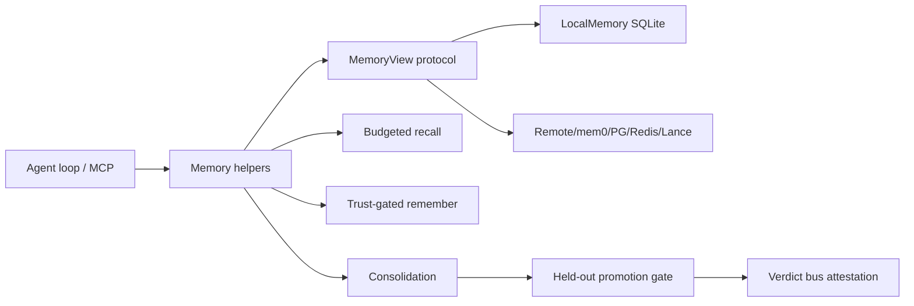

# Verel Memory System Report

## 1. Executive Summary

`verel` is not primarily a memory product; it is a verification-first agent framework. Its memory package is nevertheless one of the most technically interesting in the workspace because it treats memory as an epistemic/trust problem, not just retrieval.

Core idea: extracted facts and learned rules should not automatically become trusted memory. Verel separates:

- `epistemic_confidence`: belief that the memory is true.
- `retrieval_strength`: reachability/usefulness for recall.
- `trust`: candidate, verified, rejected.

It also has correction chains, rejected-value tombstones, volatile/TTL/pinned lifecycle flags, token-budgeted recall, held-out promotion gates, scope lattices, hosted/replicated memory, and pluggable backends.

The code is unusually explicit about adversarial cases. Many comments refer to audit rounds and attack fixes. It is more of a research/verification design than a minimal production memory service.

## 2. Mental Model

Primary memory unit:

```python
MemoryRecord(
    kind=FACT | DESIGN_RULE | SCHEMA | FAILURE | SKILL,
    subject=...,
    predicate=...,
    text=...,
    scope=...,
    subj_pred_key=...,
    provenance=[...],
    trust=CANDIDATE | VERIFIED | REJECTED,
    epistemic_confidence=...,
    retrieval_strength=...,
    support_count=...,
    detail_json=...
)
```

Lifecycle:

```text
transcript/percept/failure -> extraction/proposal -> CANDIDATE memory
-> corroboration or attestation -> VERIFIED
-> contradiction -> lower confidence or REJECTED
-> recall reinforces retrieval_strength only
-> decay/prune affects reachability, not truth
-> consolidation induces candidate design rules/schemas
-> held-out attested promotion gate verifies rules
```

The key design principle is that retrieval and truth are orthogonal.

## 3. Architecture

Core files:

- `verel/src/verel/memory/view.py`: protocol, record model, trust/ranking/decay.
- `verel/src/verel/memory/local.py`: SQLite `LocalMemory`.
- `verel/src/verel/memory/remember.py`: conversation extraction trust gate.
- `verel/src/verel/memory/recall.py`: token-budgeted, untrusted-data-fenced recall.
- `verel/src/verel/memory/consolidate.py`: failures -> design rules -> schemas.
- `verel/src/verel/memory/promotion.py`: held-out eval promotion gate.
- `verel/src/verel/memory/lattice.py`: scope hierarchy recall and graduation.
- `verel/src/verel/memory/hosted.py`: hosted memory server/client.
- `verel/src/verel/memory/replicated.py`: leader/follower replicated memory.
- `verel/src/verel/memory/mem0_backend.py`, `pg_backend.py`, `redis_backend.py`, `lance_backend.py`: backend adapters.
- `verel/src/verel/mcp_server.py`: MCP integration.

Architecture:



## 4. Essential Implementation Paths

Record/trust model:

- `MemoryRecord`, `Trust`, `MemoryKind`, `rank()`, `apply_decay()` in `view.py`.
- `make_key()` and `make_id()` define content-addressed identity from `(subject, predicate, scope)`.
- `canonical_text()` is shared by recall rendering and rejection comparison.

Local persistence:

- `LocalMemory` in `local.py`.
- SQLite table `memory` stores all fields plus optional vector JSON.
- WAL + `synchronous=FULL` when durable file-backed mode is enabled.

Write path:

- `LocalMemory.write()`.
- Same `(subject, predicate, scope)` and same text corroborates: support and confidence rise.
- Same key with different value supersedes: correction chain is stored.
- Rejected values are carried forward in a bounded ledger to prevent laundering.
- `apply_replica()` bypasses inference behavior for replication idempotence.

Recall:

- `LocalMemory.recall()` ranks by semantic cosine if embedder configured, otherwise lexical overlap.
- Excludes rejected records.
- Recall reinforces only `retrieval_strength`, never confidence.
- `recall_budgeted()` in `recall.py` greedily packs ranked memories under a token budget and fences them as untrusted data.

Remember/extraction gate:

- `remember_conversation()` in `remember.py`.
- Calls `extract_facts(...)`.
- Refuses reserved keys and non-FACT clobbering.
- Promotes only with attestation or distinct authenticated principals.
- Repeated self-asserted source labels do not count without an authenticator.

Consolidation:

- `consolidate_failures()` clusters `FAILURE` records and asks an LLM to induce `DESIGN_RULE` candidates.
- `induce_schemas()` and `induce_hierarchy()` create higher-order `SCHEMA` candidates.
- These are never auto-verified.

Promotion:

- `PromotionGate.consider()` in `promotion.py`.
- Evaluates rule over held-out corpus.
- Checks leakage canary.
- Creates signed run receipt.
- Gates through verdict bus.
- Promotes only on attested pass and F1 threshold.

Scope lattice:

- `lattice_recall()` searches scope plus ancestors with specificity bonus.
- `graduate()` promotes verified sibling beliefs to a parent scope as candidates.

Tests:

- `verel/tests/test_memory.py`
- `verel/tests/test_memory_remember.py`
- `verel/tests/test_memory_recall_budget.py`
- `verel/tests/test_memory_lifecycle.py`
- `verel/tests/test_consolidation.py`
- `verel/tests/test_promotion.py`
- `verel/tests/test_lattice.py`
- `verel/tests/test_replicated.py`
- `verel/tests/test_hosted_memory.py`

## 5. Memory Data Model

The data model is explicit and compact:

- `kind`: fact, design rule, schema, failure, skill.
- `subject`, `predicate`, `text`: structured claim.
- `scope`: repo/component/global/etc.
- `subj_pred_key`: interference key.
- `source`, `provenance`: evidence.
- `trust`: candidate/verified/rejected.
- `epistemic_confidence`: truth confidence.
- `retrieval_strength`: recall strength.
- `support_count`: corroboration count.
- `detail_json`: lifecycle flags, corrections, rejected values, schema metadata, etc.

SQLite is one table. The abstraction is in `MemoryView`, not schema complexity.

## 6. Retrieval Mechanics

Retrieval ranking:

```text
rank = W_REL * relevance
     + W_REC * retrieval_strength
     + W_CONF * epistemic_confidence
     + W_TRUST * trust_tier
```

Verified memories get a retrieval-strength floor so a trusted fact does not decay below a fresh candidate at equal relevance. Rejected memories are excluded from normal recall.

`recall_budgeted()` adds:

- Token budget.
- Highest-ranked memory always included if any relevant memory exists.
- Dropped count.
- Untrusted-data fence.
- Canonical text neutralization to prevent recalled content from forging prompt structure.

This is one of the cleanest retrieval safety designs in the workspace.

## 7. Write Mechanics

`LocalMemory.write()` is the critical method:

- Stable key from subject/predicate/scope.
- Same value -> corroboration.
- Rejected same value -> remains rejected.
- Different value -> supersede, preserve correction chain.
- Rejected value ledger is durable across supersessions.
- Embeddings are optional.

This solves a common memory bug: silently overwriting old values loses history; blindly appending creates contradictions. Verel keeps the current value plus bounded correction history.

## 8. Agent Integration

Surfaces:

- Python API through `verel.memory`.
- MCP through `verel/src/verel/mcp_server.py`.
- CLI/framework integration through the broader Verel runtime.
- Backends selected through registry/env.

The memory system is designed to sit behind agent-run CI and verdict loops: only verified work compounds. That is a different use case from personal preference memory, though it can represent facts too.

## 9. Reliability, Safety, and Trust

Strengths:

- Explicit candidate/verified/rejected trust state.
- Confidence separate from retrieval strength.
- Rejected-value anti-laundering.
- Canonicalization shared by renderer and trust gate.
- Prompt-injection neutralization in recall.
- Held-out promotion gate with attestation.
- Scope lattice for shared memory without direct trust inheritance.
- SQLite crash-safety options.
- Replication/hosted tests exist.

Risks:

- Considerably more complex than most teams need initially.
- Some LLM consolidation paths are ambitious and may be brittle.
- Lexical recall is the zero-dependency default unless embedder configured.
- Correctness of attestation/authenticator depends on external integration.
- The many security-oriented mechanisms require discipline to preserve when extending.

## 10. Tests, Evals, and Benchmarks

Verel has strong memory-specific tests:

- Memory contract.
- Remember/extraction gate.
- Lifecycle/decay.
- Budgeted recall.
- Consolidation.
- Promotion.
- Lattice.
- Hosted and replicated backends.
- MCP memory.

I did not run them. The test file coverage is unusually aligned with the design claims.

## 11. Patterns Worth Stealing

- Separate truth confidence from retrieval strength.
- Candidate/verified/rejected trust state.
- Correction chains instead of silent overwrites.
- Rejected-value tombstones to prevent laundering.
- Recall fenced as untrusted data.
- Token-budgeted recall that reports dropped memories.
- Scope lattice with graduate-up as candidate, not verified.
- Held-out promotion gates for learned rules.

## 12. Antipatterns / Risks

- The design may be overbuilt for simple personalization.
- Too much security logic in comments can become stale if tests do not enforce every invariant.
- LLM-induced design rules require careful held-out evals to avoid false generalization.
- Single-table local model is elegant but may need indexing work for large memory corpora.

## 13. Build-vs-Borrow Takeaways

Borrow aggressively for correctness-sensitive agent memory:

- Trust model.
- Recall neutralization.
- Correction/rejected-value handling.
- Promotion gate concept.
- Scope lattice semantics.

Do not start here if you need a quick MVP. The minimal viable subset would be:

- `MemoryRecord` with trust/confidence/retrieval fields.
- `write()` interference behavior.
- `recall_budgeted()` fence.
- simple local SQLite backend.

Add consolidation/promotion/replication later.

## 14. Open Questions

- How well does the trust machinery perform with real noisy agent transcripts?
- What is the operational UX for resolving candidates/rejections?
- Which backend is used in serious deployments?
- How often do induced schemas help versus overgeneralize?
- How mature is the replicated store under network partitions?

## Appendix: File Index

- Protocol/model/ranking: `verel/src/verel/memory/view.py`.
- Local store: `verel/src/verel/memory/local.py`.
- Conversation memory gate: `verel/src/verel/memory/remember.py`.
- Recall: `verel/src/verel/memory/recall.py`.
- Consolidation: `verel/src/verel/memory/consolidate.py`.
- Promotion: `verel/src/verel/memory/promotion.py`.
- Scope lattice: `verel/src/verel/memory/lattice.py`.
- Backends: `verel/src/verel/memory/*_backend.py`, `hosted.py`, `replicated.py`.
- Tests: `verel/tests/test_memory*.py`, `verel/tests/test_consolidation.py`, `verel/tests/test_promotion.py`, `verel/tests/test_lattice.py`.

